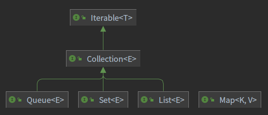

## 容器基础

### 概述

#### 基础特性

`Java` 中常用的储存方式是数组和容器，而其又有一下特点。

- 数组
  - 长度固定
  - 可储存基本类型，也可储存引用类型（对象）
- 容器
  - 长度可变
  - 只能储存引用数据类型，基础类型需要转换为对应包装类（int->Integer）

#### 分类

在 `Java` 中容器有两大类，分别是 `Collection` 和 `Map` ，而 `Collection` 又分为 `Set` 、`List` 和 `Queue` 。

  

### 接口分析

#### 迭代器

`Iterable` 定义了迭代器模式，用于遍历容器中的元素。

```java
public interface Iterable<T> {
    // 获取迭代器
    Iterator<T> iterator();
    // 顺序迭代元素，并对元素执行指定的操作
    default void forEach(Consumer<? super T> action) {
        Objects.requireNonNull(action);
        for (T t : this) {
            action.accept(t);
        }
    }
    default Spliterator<T> spliterator() {
        return Spliterators.spliteratorUnknownSize(iterator(), 0);
    }
}
```

**迭代器模式** - **提供一种方法顺序访问一个聚合对象中各个元素，而又无须暴露该对象的内部表示**。

#### 集合接口

本质上 `Collection` 是对 `Iterable` 的补充和拓展。

```java
public interface Collection<E> extends Iterable<E> {
    // 元素数量
    int size();
    // 是否为空
    boolean isEmpty();
    // 是否包含指定的元素
    boolean contains(Object o);
    // 获取迭代器
    Iterator<E> iterator();
    // 返回包含此集合中所有元素的数组
    Object[] toArray();
    // 返回所有元素的数组，可以用泛型指定类型
    <T> T[] toArray(T[] a);
    // 添加元素
    boolean add(E e);
    // 移除元素
    boolean remove(Object o);
    // 是否包含指定集合的所有元素
    boolean containsAll(Collection<?> c);
    // 将集合多个元素添加到此集合
    boolean addAll(Collection<? extends E> c);
    // 移除多个元素
    boolean removeAll(Collection<?> c);
    // 删除满足给条件的此集合的所有元素。 
    default boolean removeIf(Predicate<? super E> filter) {
        Objects.requireNonNull(filter);
        boolean removed = false;
        // 获取迭代器
        final Iterator<E> each = iterator();
        while (each.hasNext()) {
            // 是否匹配
            if (filter.test(each.next())) {
                each.remove();  // 移除元素
                removed = true;
            }
        }
        return removed;
    }
    // 移除此集合中没有指定集合中的元素
    boolean retainAll(Collection<?> c);
    // 从此集合中删除所有元素
    void clear();
    // 比较对象是否与此集合相同
    boolean equals(Object o);
    // 返回此集合的hash值
    int hashCode();

    @Override
    default Spliterator<E> spliterator() {
        return Spliterators.spliterator(this, 0);
    }

    default Stream<E> stream() {
        return StreamSupport.stream(spliterator(), false);
    }

    default Stream<E> parallelStream() {
        return StreamSupport.stream(spliterator(), true);
    }
}
```

`Collection` 接口类还有一个抽象的实现类 `AbstractCollection` 。

```java
public abstract class AbstractCollection<E> implements Collection<E> {
    public boolean contains(Object o) {
        Iterator<E> it = iterator(); // 迭代器
        if (o==null) { // 查找的元素为空
            // 查找集合中为null的元素
            while (it.hasNext())
                if (it.next()==null)
                    return true;
        } else { // 查找元素不为空
            // 查找集合中匹配的元素
            while (it.hasNext())
                if (o.equals(it.next()))
                    return true;
        }
        // 没有找到，返回false
        return false;
    }
    
    public Object[] toArray() {
        // 创建一个大小为当前集合元素数量的数组
        Object[] r = new Object[size()];
        // 迭代器
        Iterator<E> it = iterator();
       	// 将集合中的元素通过迭代器依次送入数组中
        for (int i = 0; i < r.length; i++) {
            if (! it.hasNext())
                return Arrays.copyOf(r, i);
            r[i] = it.next();
        }
        // 最后在判断一下元素是否都遍历完成
        return it.hasNext() ? finishToArray(r, it) : r;
    }
    
    public <T> T[] toArray(T[] a) {
        // 元素数量
        int size = size();
        // 如果传入的数组大小大于等于当前元素数量，直接使用传入的数据进行赋值
        // 如果小于当前元素数量，需要创建一个新的数组，此处用了反射等效于 T[] x = {length};
        T[] r = a.length >= size ? a : (T[])java.lang.reflect.Array.newInstance(a.getClass().getComponentType(), size);
        // 迭代器
        Iterator<E> it = iterator();
        // 依次放入元素
        for (int i = 0; i < r.length; i++) {
            // 没有下一个元素
            if (! it.hasNext()) {
                // a等于r表示当前下标集合中已经没有值，只能填空
                if (a == r) {
                    r[i] = null;
                // a大小小于i，说明r是新建的数组，r比元素数量大
                } else if (a.length < i) {
                    // 新建的数组大小大于元素的大小，截取定长的数组并返回
                    return Arrays.copyOf(r, i);
                } else {
                    // a不等于r且a大小不小于i，
                    // 说明r是新建的数组，a也等于或大于元素数
                    // 将r的值复制一份给a
                    System.arraycopy(r, 0, a, 0, i);
                    // 如果a大小比元素数大，则当前数组元素置空
                    if (a.length > i) {
                        a[i] = null;
                    }
                }
                // 返回a，当前a肯定是有值的
                return a;
            }
            // 将集合中的元素赋值到数组中
            r[i] = (T)it.next();
        }
        // 当前集合还有元素，继续遍历，没有则返回r
        return it.hasNext() ? finishToArray(r, it) : r;
    }
    
    private static <T> T[] finishToArray(T[] r, Iterator<?> it) {
        int i = r.length;
        while (it.hasNext()) {
            int cap = r.length;
            if (i == cap) {
                int newCap = cap + (cap >> 1) + 1;
                // overflow-conscious code
                if (newCap - MAX_ARRAY_SIZE > 0)
                    newCap = hugeCapacity(cap + 1);
                r = Arrays.copyOf(r, newCap);
            }
            r[i++] = (T)it.next();
        }
        // trim if overallocated
        return (i == r.length) ? r : Arrays.copyOf(r, i);
    }
    
    private static int hugeCapacity(int minCapacity) {
        if (minCapacity < 0) // overflow
            throw new OutOfMemoryError
                ("Required array size too large");
        return (minCapacity > MAX_ARRAY_SIZE) ?
            Integer.MAX_VALUE :
            MAX_ARRAY_SIZE;
    }
    
    public boolean containsAll(Collection<?> c) {
        // 使用 contains 方法循环
        for (Object e : c)
            if (!contains(e))
                return false;
        return true;
    }
    
    public boolean addAll(Collection<? extends E> c) {
        boolean modified = false;
        for (E e : c)
            if (add(e))
                modified = true;
        return modified;
    }
    
    public boolean removeAll(Collection<?> c) {
        Objects.requireNonNull(c);
        boolean modified = false;
        Iterator<?> it = iterator();
        while (it.hasNext()) {
            if (c.contains(it.next())) {
                it.remove();
                modified = true;
            }
        }
        return modified;
    }
    
    public boolean retainAll(Collection<?> c) {
        Objects.requireNonNull(c);
        boolean modified = false;
        Iterator<E> it = iterator();
        while (it.hasNext()) {
            if (!c.contains(it.next())) {
                it.remove();
                modified = true;
            }
        }
        return modified;
    }
    
    public void clear() {
        Iterator<E> it = iterator();
        while (it.hasNext()) {
            it.next();
            it.remove();
        }
    }
    
    public String toString() {
        Iterator<E> it = iterator();
        if (! it.hasNext())
            return "[]";

        StringBuilder sb = new StringBuilder();
        sb.append('[');
        for (;;) {
            E e = it.next();
            sb.append(e == this ? "(this Collection)" : e);
            if (! it.hasNext())
                return sb.append(']').toString();
            sb.append(',').append(' ');
        }
    }
}
```


#### 排序接口

若某个类实现了 `Comparable` 接口则表示此类是可以被进行比较的，也就可以对此类组成的一个集合进行排序。

```java
public interface Comparable<T> {
    // 将此对象与指定的对象进行比较以进行排序
    public int compareTo(T o);
}
```

`Comparator` 是比较接口，如果某个没有继承 `Comparable` 类需要排序时，但是其本身并不支持比较，此时就需要实现一个比较器来进行排序，这个比较器只需要实现 `Comparator` 接口即可。

```java
public interface Comparator<T> {
    
    int compare(T o1, T o2);
    
    boolean equals(Object obj);
    
    default Comparator<T> reversed() {
        return Collections.reverseOrder(this);
    }
    
    default Comparator<T> thenComparing(Comparator<? super T> other) {
        Objects.requireNonNull(other);
        return (Comparator<T> & Serializable) (c1, c2) -> {
            int res = compare(c1, c2);
            return (res != 0) ? res : other.compare(c1, c2);
        };
    }
    
    default <U> Comparator<T> thenComparing(Function<? super T, ? extends U> keyExtractor, Comparator<? super U> keyComparator) {
        return thenComparing(comparing(keyExtractor, keyComparator));
    }
    
    default <U extends Comparable<? super U>> Comparator<T> thenComparing(Function<? super T, ? extends U> keyExtractor) {
        return thenComparing(comparing(keyExtractor));
    }
    
    default Comparator<T> thenComparingInt(ToIntFunction<? super T> keyExtractor) {
        return thenComparing(comparingInt(keyExtractor));
    }

    default Comparator<T> thenComparingLong(ToLongFunction<? super T> keyExtractor) {
        return thenComparing(comparingLong(keyExtractor));
    }
    
    default Comparator<T> thenComparingDouble(ToDoubleFunction<? super T> keyExtractor) {
        return thenComparing(comparingDouble(keyExtractor));
    }
    
    public static <T extends Comparable<? super T>> Comparator<T> reverseOrder() {
        return Collections.reverseOrder();
    }
    
    @SuppressWarnings("unchecked")
    public static <T extends Comparable<? super T>> Comparator<T> naturalOrder() {
        return (Comparator<T>) Comparators.NaturalOrderComparator.INSTANCE;
    }
    
    public static <T> Comparator<T> nullsFirst(Comparator<? super T> comparator) {
        return new Comparators.NullComparator<>(true, comparator);
    }
    
    public static <T> Comparator<T> nullsLast(Comparator<? super T> comparator) {
        return new Comparators.NullComparator<>(false, comparator);
    }
    
    public static <T, U> Comparator<T> comparing(Function<? super T, ? extends U> keyExtractor, Comparator<? super U> keyComparator) {
        Objects.requireNonNull(keyExtractor);
        Objects.requireNonNull(keyComparator);
        return (Comparator<T> & Serializable)
            (c1, c2) -> keyComparator.compare(keyExtractor.apply(c1),
                                              keyExtractor.apply(c2));
    }
    
    public static <T, U extends Comparable<? super U>> Comparator<T> comparing(Function<? super T, ? extends U> keyExtractor) {
        Objects.requireNonNull(keyExtractor);
        return (Comparator<T> & Serializable)
            (c1, c2) -> keyExtractor.apply(c1).compareTo(keyExtractor.apply(c2));
    }
    
    public static <T> Comparator<T> comparingInt(ToIntFunction<? super T> keyExtractor) {
        Objects.requireNonNull(keyExtractor);
        return (Comparator<T> & Serializable)
            (c1, c2) -> Integer.compare(keyExtractor.applyAsInt(c1), keyExtractor.applyAsInt(c2));
    }
}
```

#### 克隆接口

如果在 `Java` 中一个类需要实现克隆功能即复制，必须实现 `Cloneable` 接口，否则其在调用 `clone` 方法时会报错。

```java
public interface Cloneable {}
```

在 `Cloneable` 接口中并没有内容，具体的 `clone` 方法在 `Object` 类中。

```java
protected native Object clone() throws CloneNotSupportedException;
```

`clone` 方法是一个本地方法，在类未实现 `Cloneable` 接口时调用会抛出 `CloneNotSupportedException` 异常。

#### fail-fast

`fail-fast` 是一种 `Java` 容器的错误检测机制，当多个线程改变容器的结构时，就可能会触发 `fail-fast` 机制。

定义两个线程，一个从线程中遍历元素，另一个在改变容器结构。也就是在删除容器中的某些内容，令容器中元素组成变化。

```java
// static global variable
private static List<Integer> list = new ArrayList<>();
// main method code
for (int i = 0; i < 100; i++) {
    list.add(i);
}
new Thread(()->{
    Iterator<Integer> iterator = list.iterator();
    while (iterator.hasNext()){
        Integer next = iterator.next();
        LOGGER.info("读取元素 -- {}", next);
        try {
            Thread.sleep(100);
        } catch (InterruptedException e) {
            LOGGER.error("线程中断", e.fillInStackTrace());
        }
    }
}).start();
new Thread(()->{
    for (int i = 1; i < list.size(); i++) {
        if (i%2 == 0){
            LOGGER.info("移除元素 -- {}", i);
            list.remove(i);
        }
    }
}).start();
```

执行结果

```java
// more info ....
2022-02-25 15:21:45.683 [Thread-1] INFO  java.lang.Thread - 移除元素 -- 64
2022-02-25 15:21:45.683 [Thread-1] INFO  java.lang.Thread - 移除元素 -- 66
Exception in thread "Thread-0" java.util.ConcurrentModificationException
	at java.util.ArrayList$Itr.checkForComodification(ArrayList.java:909)
	at java.util.ArrayList$Itr.next(ArrayList.java:859)
	at com.mochen.advance.container.FailFastDemo.lambda$main$0(FailFastDemo.java:21)
```

可以看到此操作触发了 `fail-fast` 机制，抛出了 `ConcurrentModificationException` 异常。解决方法也很简单，在修改和读取中的代码中加入 `synchronized` 关键字或者使用锁同步，也可以使用 `juc` 包下的并发容器。

## List

### 概述

`List` 是容器中的一个大类，其包含了许多不同实现和数据结构的容器，包括 `ArrayList` 、`LinkedList` 等实现。

`List` 是一个接口，它继承于 `Collection` 的接口，代表一个有序的队列。


```java
public interface List<E> extends Collection<E> {
    // Query Operations

    /**
     * Returns the number of elements in this list.  If this list contains
     * more than <tt>Integer.MAX_VALUE</tt> elements, returns
     * <tt>Integer.MAX_VALUE</tt>.
     *
     * @return the number of elements in this list
     */
    int size();

    /**
     * Returns <tt>true</tt> if this list contains no elements.
     *
     * @return <tt>true</tt> if this list contains no elements
     */
    boolean isEmpty();

    /**
     * Returns <tt>true</tt> if this list contains the specified element.
     * More formally, returns <tt>true</tt> if and only if this list contains
     * at least one element <tt>e</tt> such that
     * <tt>(o==null&nbsp;?&nbsp;e==null&nbsp;:&nbsp;o.equals(e))</tt>.
     *
     * @param o element whose presence in this list is to be tested
     * @return <tt>true</tt> if this list contains the specified element
     * @throws ClassCastException if the type of the specified element
     *         is incompatible with this list
     * (<a href="Collection.html#optional-restrictions">optional</a>)
     * @throws NullPointerException if the specified element is null and this
     *         list does not permit null elements
     * (<a href="Collection.html#optional-restrictions">optional</a>)
     */
    boolean contains(Object o);

    /**
     * Returns an iterator over the elements in this list in proper sequence.
     *
     * @return an iterator over the elements in this list in proper sequence
     */
    Iterator<E> iterator();

    /**
     * Returns an array containing all of the elements in this list in proper
     * sequence (from first to last element).
     *
     * <p>The returned array will be "safe" in that no references to it are
     * maintained by this list.  (In other words, this method must
     * allocate a new array even if this list is backed by an array).
     * The caller is thus free to modify the returned array.
     *
     * <p>This method acts as bridge between array-based and collection-based
     * APIs.
     *
     * @return an array containing all of the elements in this list in proper
     *         sequence
     * @see Arrays#asList(Object[])
     */
    Object[] toArray();

    /**
     * Returns an array containing all of the elements in this list in
     * proper sequence (from first to last element); the runtime type of
     * the returned array is that of the specified array.  If the list fits
     * in the specified array, it is returned therein.  Otherwise, a new
     * array is allocated with the runtime type of the specified array and
     * the size of this list.
     *
     * <p>If the list fits in the specified array with room to spare (i.e.,
     * the array has more elements than the list), the element in the array
     * immediately following the end of the list is set to <tt>null</tt>.
     * (This is useful in determining the length of the list <i>only</i> if
     * the caller knows that the list does not contain any null elements.)
     *
     * <p>Like the {@link #toArray()} method, this method acts as bridge between
     * array-based and collection-based APIs.  Further, this method allows
     * precise control over the runtime type of the output array, and may,
     * under certain circumstances, be used to save allocation costs.
     *
     * <p>Suppose <tt>x</tt> is a list known to contain only strings.
     * The following code can be used to dump the list into a newly
     * allocated array of <tt>String</tt>:
     *
     * <pre>{@code
     *     String[] y = x.toArray(new String[0]);
     * }</pre>
     *
     * Note that <tt>toArray(new Object[0])</tt> is identical in function to
     * <tt>toArray()</tt>.
     *
     * @param a the array into which the elements of this list are to
     *          be stored, if it is big enough; otherwise, a new array of the
     *          same runtime type is allocated for this purpose.
     * @return an array containing the elements of this list
     * @throws ArrayStoreException if the runtime type of the specified array
     *         is not a supertype of the runtime type of every element in
     *         this list
     * @throws NullPointerException if the specified array is null
     */
    <T> T[] toArray(T[] a);


    // Modification Operations

    /**
     * Appends the specified element to the end of this list (optional
     * operation).
     *
     * <p>Lists that support this operation may place limitations on what
     * elements may be added to this list.  In particular, some
     * lists will refuse to add null elements, and others will impose
     * restrictions on the type of elements that may be added.  List
     * classes should clearly specify in their documentation any restrictions
     * on what elements may be added.
     *
     * @param e element to be appended to this list
     * @return <tt>true</tt> (as specified by {@link Collection#add})
     * @throws UnsupportedOperationException if the <tt>add</tt> operation
     *         is not supported by this list
     * @throws ClassCastException if the class of the specified element
     *         prevents it from being added to this list
     * @throws NullPointerException if the specified element is null and this
     *         list does not permit null elements
     * @throws IllegalArgumentException if some property of this element
     *         prevents it from being added to this list
     */
    boolean add(E e);

    /**
     * Removes the first occurrence of the specified element from this list,
     * if it is present (optional operation).  If this list does not contain
     * the element, it is unchanged.  More formally, removes the element with
     * the lowest index <tt>i</tt> such that
     * <tt>(o==null&nbsp;?&nbsp;get(i)==null&nbsp;:&nbsp;o.equals(get(i)))</tt>
     * (if such an element exists).  Returns <tt>true</tt> if this list
     * contained the specified element (or equivalently, if this list changed
     * as a result of the call).
     *
     * @param o element to be removed from this list, if present
     * @return <tt>true</tt> if this list contained the specified element
     * @throws ClassCastException if the type of the specified element
     *         is incompatible with this list
     * (<a href="Collection.html#optional-restrictions">optional</a>)
     * @throws NullPointerException if the specified element is null and this
     *         list does not permit null elements
     * (<a href="Collection.html#optional-restrictions">optional</a>)
     * @throws UnsupportedOperationException if the <tt>remove</tt> operation
     *         is not supported by this list
     */
    boolean remove(Object o);


    // Bulk Modification Operations

    /**
     * Returns <tt>true</tt> if this list contains all of the elements of the
     * specified collection.
     *
     * @param  c collection to be checked for containment in this list
     * @return <tt>true</tt> if this list contains all of the elements of the
     *         specified collection
     * @throws ClassCastException if the types of one or more elements
     *         in the specified collection are incompatible with this
     *         list
     * (<a href="Collection.html#optional-restrictions">optional</a>)
     * @throws NullPointerException if the specified collection contains one
     *         or more null elements and this list does not permit null
     *         elements
     *         (<a href="Collection.html#optional-restrictions">optional</a>),
     *         or if the specified collection is null
     * @see #contains(Object)
     */
    boolean containsAll(Collection<?> c);

    /**
     * Appends all of the elements in the specified collection to the end of
     * this list, in the order that they are returned by the specified
     * collection's iterator (optional operation).  The behavior of this
     * operation is undefined if the specified collection is modified while
     * the operation is in progress.  (Note that this will occur if the
     * specified collection is this list, and it's nonempty.)
     *
     * @param c collection containing elements to be added to this list
     * @return <tt>true</tt> if this list changed as a result of the call
     * @throws UnsupportedOperationException if the <tt>addAll</tt> operation
     *         is not supported by this list
     * @throws ClassCastException if the class of an element of the specified
     *         collection prevents it from being added to this list
     * @throws NullPointerException if the specified collection contains one
     *         or more null elements and this list does not permit null
     *         elements, or if the specified collection is null
     * @throws IllegalArgumentException if some property of an element of the
     *         specified collection prevents it from being added to this list
     * @see #add(Object)
     */
    boolean addAll(Collection<? extends E> c);

    /**
     * Inserts all of the elements in the specified collection into this
     * list at the specified position (optional operation).  Shifts the
     * element currently at that position (if any) and any subsequent
     * elements to the right (increases their indices).  The new elements
     * will appear in this list in the order that they are returned by the
     * specified collection's iterator.  The behavior of this operation is
     * undefined if the specified collection is modified while the
     * operation is in progress.  (Note that this will occur if the specified
     * collection is this list, and it's nonempty.)
     *
     * @param index index at which to insert the first element from the
     *              specified collection
     * @param c collection containing elements to be added to this list
     * @return <tt>true</tt> if this list changed as a result of the call
     * @throws UnsupportedOperationException if the <tt>addAll</tt> operation
     *         is not supported by this list
     * @throws ClassCastException if the class of an element of the specified
     *         collection prevents it from being added to this list
     * @throws NullPointerException if the specified collection contains one
     *         or more null elements and this list does not permit null
     *         elements, or if the specified collection is null
     * @throws IllegalArgumentException if some property of an element of the
     *         specified collection prevents it from being added to this list
     * @throws IndexOutOfBoundsException if the index is out of range
     *         (<tt>index &lt; 0 || index &gt; size()</tt>)
     */
    boolean addAll(int index, Collection<? extends E> c);

    /**
     * Removes from this list all of its elements that are contained in the
     * specified collection (optional operation).
     *
     * @param c collection containing elements to be removed from this list
     * @return <tt>true</tt> if this list changed as a result of the call
     * @throws UnsupportedOperationException if the <tt>removeAll</tt> operation
     *         is not supported by this list
     * @throws ClassCastException if the class of an element of this list
     *         is incompatible with the specified collection
     * (<a href="Collection.html#optional-restrictions">optional</a>)
     * @throws NullPointerException if this list contains a null element and the
     *         specified collection does not permit null elements
     *         (<a href="Collection.html#optional-restrictions">optional</a>),
     *         or if the specified collection is null
     * @see #remove(Object)
     * @see #contains(Object)
     */
    boolean removeAll(Collection<?> c);

    /**
     * Retains only the elements in this list that are contained in the
     * specified collection (optional operation).  In other words, removes
     * from this list all of its elements that are not contained in the
     * specified collection.
     *
     * @param c collection containing elements to be retained in this list
     * @return <tt>true</tt> if this list changed as a result of the call
     * @throws UnsupportedOperationException if the <tt>retainAll</tt> operation
     *         is not supported by this list
     * @throws ClassCastException if the class of an element of this list
     *         is incompatible with the specified collection
     * (<a href="Collection.html#optional-restrictions">optional</a>)
     * @throws NullPointerException if this list contains a null element and the
     *         specified collection does not permit null elements
     *         (<a href="Collection.html#optional-restrictions">optional</a>),
     *         or if the specified collection is null
     * @see #remove(Object)
     * @see #contains(Object)
     */
    boolean retainAll(Collection<?> c);

    /**
     * Replaces each element of this list with the result of applying the
     * operator to that element.  Errors or runtime exceptions thrown by
     * the operator are relayed to the caller.
     *
     * @implSpec
     * The default implementation is equivalent to, for this {@code list}:
     * <pre>{@code
     *     final ListIterator<E> li = list.listIterator();
     *     while (li.hasNext()) {
     *         li.set(operator.apply(li.next()));
     *     }
     * }</pre>
     *
     * If the list's list-iterator does not support the {@code set} operation
     * then an {@code UnsupportedOperationException} will be thrown when
     * replacing the first element.
     *
     * @param operator the operator to apply to each element
     * @throws UnsupportedOperationException if this list is unmodifiable.
     *         Implementations may throw this exception if an element
     *         cannot be replaced or if, in general, modification is not
     *         supported
     * @throws NullPointerException if the specified operator is null or
     *         if the operator result is a null value and this list does
     *         not permit null elements
     *         (<a href="Collection.html#optional-restrictions">optional</a>)
     * @since 1.8
     */
    default void replaceAll(UnaryOperator<E> operator) {
        Objects.requireNonNull(operator);
        final ListIterator<E> li = this.listIterator();
        while (li.hasNext()) {
            li.set(operator.apply(li.next()));
        }
    }

    /**
     * Sorts this list according to the order induced by the specified
     * {@link Comparator}.
     *
     * <p>All elements in this list must be <i>mutually comparable</i> using the
     * specified comparator (that is, {@code c.compare(e1, e2)} must not throw
     * a {@code ClassCastException} for any elements {@code e1} and {@code e2}
     * in the list).
     *
     * <p>If the specified comparator is {@code null} then all elements in this
     * list must implement the {@link Comparable} interface and the elements'
     * {@linkplain Comparable natural ordering} should be used.
     *
     * <p>This list must be modifiable, but need not be resizable.
     *
     * @implSpec
     * The default implementation obtains an array containing all elements in
     * this list, sorts the array, and iterates over this list resetting each
     * element from the corresponding position in the array. (This avoids the
     * n<sup>2</sup> log(n) performance that would result from attempting
     * to sort a linked list in place.)
     *
     * @implNote
     * This implementation is a stable, adaptive, iterative mergesort that
     * requires far fewer than n lg(n) comparisons when the input array is
     * partially sorted, while offering the performance of a traditional
     * mergesort when the input array is randomly ordered.  If the input array
     * is nearly sorted, the implementation requires approximately n
     * comparisons.  Temporary storage requirements vary from a small constant
     * for nearly sorted input arrays to n/2 object references for randomly
     * ordered input arrays.
     *
     * <p>The implementation takes equal advantage of ascending and
     * descending order in its input array, and can take advantage of
     * ascending and descending order in different parts of the same
     * input array.  It is well-suited to merging two or more sorted arrays:
     * simply concatenate the arrays and sort the resulting array.
     *
     * <p>The implementation was adapted from Tim Peters's list sort for Python
     * (<a href="http://svn.python.org/projects/python/trunk/Objects/listsort.txt">
     * TimSort</a>).  It uses techniques from Peter McIlroy's "Optimistic
     * Sorting and Information Theoretic Complexity", in Proceedings of the
     * Fourth Annual ACM-SIAM Symposium on Discrete Algorithms, pp 467-474,
     * January 1993.
     *
     * @param c the {@code Comparator} used to compare list elements.
     *          A {@code null} value indicates that the elements'
     *          {@linkplain Comparable natural ordering} should be used
     * @throws ClassCastException if the list contains elements that are not
     *         <i>mutually comparable</i> using the specified comparator
     * @throws UnsupportedOperationException if the list's list-iterator does
     *         not support the {@code set} operation
     * @throws IllegalArgumentException
     *         (<a href="Collection.html#optional-restrictions">optional</a>)
     *         if the comparator is found to violate the {@link Comparator}
     *         contract
     * @since 1.8
     */
    @SuppressWarnings({"unchecked", "rawtypes"})
    default void sort(Comparator<? super E> c) {
        Object[] a = this.toArray();
        Arrays.sort(a, (Comparator) c);
        ListIterator<E> i = this.listIterator();
        for (Object e : a) {
            i.next();
            i.set((E) e);
        }
    }

    /**
     * Removes all of the elements from this list (optional operation).
     * The list will be empty after this call returns.
     *
     * @throws UnsupportedOperationException if the <tt>clear</tt> operation
     *         is not supported by this list
     */
    void clear();


    // Comparison and hashing

    /**
     * Compares the specified object with this list for equality.  Returns
     * <tt>true</tt> if and only if the specified object is also a list, both
     * lists have the same size, and all corresponding pairs of elements in
     * the two lists are <i>equal</i>.  (Two elements <tt>e1</tt> and
     * <tt>e2</tt> are <i>equal</i> if <tt>(e1==null ? e2==null :
     * e1.equals(e2))</tt>.)  In other words, two lists are defined to be
     * equal if they contain the same elements in the same order.  This
     * definition ensures that the equals method works properly across
     * different implementations of the <tt>List</tt> interface.
     *
     * @param o the object to be compared for equality with this list
     * @return <tt>true</tt> if the specified object is equal to this list
     */
    boolean equals(Object o);

    /**
     * Returns the hash code value for this list.  The hash code of a list
     * is defined to be the result of the following calculation:
     * <pre>{@code
     *     int hashCode = 1;
     *     for (E e : list)
     *         hashCode = 31*hashCode + (e==null ? 0 : e.hashCode());
     * }</pre>
     * This ensures that <tt>list1.equals(list2)</tt> implies that
     * <tt>list1.hashCode()==list2.hashCode()</tt> for any two lists,
     * <tt>list1</tt> and <tt>list2</tt>, as required by the general
     * contract of {@link Object#hashCode}.
     *
     * @return the hash code value for this list
     * @see Object#equals(Object)
     * @see #equals(Object)
     */
    int hashCode();


    // Positional Access Operations

    /**
     * Returns the element at the specified position in this list.
     *
     * @param index index of the element to return
     * @return the element at the specified position in this list
     * @throws IndexOutOfBoundsException if the index is out of range
     *         (<tt>index &lt; 0 || index &gt;= size()</tt>)
     */
    E get(int index);

    /**
     * Replaces the element at the specified position in this list with the
     * specified element (optional operation).
     *
     * @param index index of the element to replace
     * @param element element to be stored at the specified position
     * @return the element previously at the specified position
     * @throws UnsupportedOperationException if the <tt>set</tt> operation
     *         is not supported by this list
     * @throws ClassCastException if the class of the specified element
     *         prevents it from being added to this list
     * @throws NullPointerException if the specified element is null and
     *         this list does not permit null elements
     * @throws IllegalArgumentException if some property of the specified
     *         element prevents it from being added to this list
     * @throws IndexOutOfBoundsException if the index is out of range
     *         (<tt>index &lt; 0 || index &gt;= size()</tt>)
     */
    E set(int index, E element);

    /**
     * Inserts the specified element at the specified position in this list
     * (optional operation).  Shifts the element currently at that position
     * (if any) and any subsequent elements to the right (adds one to their
     * indices).
     *
     * @param index index at which the specified element is to be inserted
     * @param element element to be inserted
     * @throws UnsupportedOperationException if the <tt>add</tt> operation
     *         is not supported by this list
     * @throws ClassCastException if the class of the specified element
     *         prevents it from being added to this list
     * @throws NullPointerException if the specified element is null and
     *         this list does not permit null elements
     * @throws IllegalArgumentException if some property of the specified
     *         element prevents it from being added to this list
     * @throws IndexOutOfBoundsException if the index is out of range
     *         (<tt>index &lt; 0 || index &gt; size()</tt>)
     */
    void add(int index, E element);

    /**
     * Removes the element at the specified position in this list (optional
     * operation).  Shifts any subsequent elements to the left (subtracts one
     * from their indices).  Returns the element that was removed from the
     * list.
     *
     * @param index the index of the element to be removed
     * @return the element previously at the specified position
     * @throws UnsupportedOperationException if the <tt>remove</tt> operation
     *         is not supported by this list
     * @throws IndexOutOfBoundsException if the index is out of range
     *         (<tt>index &lt; 0 || index &gt;= size()</tt>)
     */
    E remove(int index);


    // Search Operations

    /**
     * Returns the index of the first occurrence of the specified element
     * in this list, or -1 if this list does not contain the element.
     * More formally, returns the lowest index <tt>i</tt> such that
     * <tt>(o==null&nbsp;?&nbsp;get(i)==null&nbsp;:&nbsp;o.equals(get(i)))</tt>,
     * or -1 if there is no such index.
     *
     * @param o element to search for
     * @return the index of the first occurrence of the specified element in
     *         this list, or -1 if this list does not contain the element
     * @throws ClassCastException if the type of the specified element
     *         is incompatible with this list
     *         (<a href="Collection.html#optional-restrictions">optional</a>)
     * @throws NullPointerException if the specified element is null and this
     *         list does not permit null elements
     *         (<a href="Collection.html#optional-restrictions">optional</a>)
     */
    int indexOf(Object o);

    /**
     * Returns the index of the last occurrence of the specified element
     * in this list, or -1 if this list does not contain the element.
     * More formally, returns the highest index <tt>i</tt> such that
     * <tt>(o==null&nbsp;?&nbsp;get(i)==null&nbsp;:&nbsp;o.equals(get(i)))</tt>,
     * or -1 if there is no such index.
     *
     * @param o element to search for
     * @return the index of the last occurrence of the specified element in
     *         this list, or -1 if this list does not contain the element
     * @throws ClassCastException if the type of the specified element
     *         is incompatible with this list
     *         (<a href="Collection.html#optional-restrictions">optional</a>)
     * @throws NullPointerException if the specified element is null and this
     *         list does not permit null elements
     *         (<a href="Collection.html#optional-restrictions">optional</a>)
     */
    int lastIndexOf(Object o);


    // List Iterators

    /**
     * Returns a list iterator over the elements in this list (in proper
     * sequence).
     *
     * @return a list iterator over the elements in this list (in proper
     *         sequence)
     */
    ListIterator<E> listIterator();

    /**
     * Returns a list iterator over the elements in this list (in proper
     * sequence), starting at the specified position in the list.
     * The specified index indicates the first element that would be
     * returned by an initial call to {@link ListIterator#next next}.
     * An initial call to {@link ListIterator#previous previous} would
     * return the element with the specified index minus one.
     *
     * @param index index of the first element to be returned from the
     *        list iterator (by a call to {@link ListIterator#next next})
     * @return a list iterator over the elements in this list (in proper
     *         sequence), starting at the specified position in the list
     * @throws IndexOutOfBoundsException if the index is out of range
     *         ({@code index < 0 || index > size()})
     */
    ListIterator<E> listIterator(int index);

    // View

    /**
     * Returns a view of the portion of this list between the specified
     * <tt>fromIndex</tt>, inclusive, and <tt>toIndex</tt>, exclusive.  (If
     * <tt>fromIndex</tt> and <tt>toIndex</tt> are equal, the returned list is
     * empty.)  The returned list is backed by this list, so non-structural
     * changes in the returned list are reflected in this list, and vice-versa.
     * The returned list supports all of the optional list operations supported
     * by this list.<p>
     *
     * This method eliminates the need for explicit range operations (of
     * the sort that commonly exist for arrays).  Any operation that expects
     * a list can be used as a range operation by passing a subList view
     * instead of a whole list.  For example, the following idiom
     * removes a range of elements from a list:
     * <pre>{@code
     *      list.subList(from, to).clear();
     * }</pre>
     * Similar idioms may be constructed for <tt>indexOf</tt> and
     * <tt>lastIndexOf</tt>, and all of the algorithms in the
     * <tt>Collections</tt> class can be applied to a subList.<p>
     *
     * The semantics of the list returned by this method become undefined if
     * the backing list (i.e., this list) is <i>structurally modified</i> in
     * any way other than via the returned list.  (Structural modifications are
     * those that change the size of this list, or otherwise perturb it in such
     * a fashion that iterations in progress may yield incorrect results.)
     *
     * @param fromIndex low endpoint (inclusive) of the subList
     * @param toIndex high endpoint (exclusive) of the subList
     * @return a view of the specified range within this list
     * @throws IndexOutOfBoundsException for an illegal endpoint index value
     *         (<tt>fromIndex &lt; 0 || toIndex &gt; size ||
     *         fromIndex &gt; toIndex</tt>)
     */
    List<E> subList(int fromIndex, int toIndex);

    /**
     * Creates a {@link Spliterator} over the elements in this list.
     *
     * <p>The {@code Spliterator} reports {@link Spliterator#SIZED} and
     * {@link Spliterator#ORDERED}.  Implementations should document the
     * reporting of additional characteristic values.
     *
     * @implSpec
     * The default implementation creates a
     * <em><a href="Spliterator.html#binding">late-binding</a></em> spliterator
     * from the list's {@code Iterator}.  The spliterator inherits the
     * <em>fail-fast</em> properties of the list's iterator.
     *
     * @implNote
     * The created {@code Spliterator} additionally reports
     * {@link Spliterator#SUBSIZED}.
     *
     * @return a {@code Spliterator} over the elements in this list
     * @since 1.8
     */
    @Override
    default Spliterator<E> spliterator() {
        return Spliterators.spliterator(this, Spliterator.ORDERED);
    }
}
```


