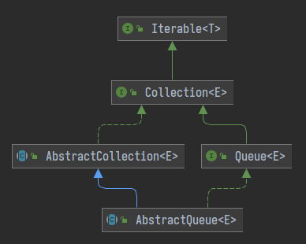

前置知识：

- 并发相关**概念** 
- Java 基础
- Java 8 Lambda

## 容器基础

### 概述

Java 中包含了很多的基础类型例如 `int` 、`long` 、`double`、`float` 等多种基础数据类型，还有很多引用数据类型，如：`String`、`Integer`、`Long` 等等。这些都是单独的数据，如果需要使用多个单独数据进行打包时，就会用到数组。但是数组在使用过程中也会面临诸多问题，如大小不可变、根据值查找元素较慢、增加删除效率差并且无封装方法，操作都需要用户实现。所以就需要一个新的容器，一个可以有着多种实现，并可以用来解决多种问题的容器。于是 Java 就诞生了以 `Collection` 集合与 `Map` 键值映射表为主的两类数据容器。

#### 基础特性

Java 中常用的储存方式是数组和容器，而其又有一下特点。

- 数组
  - 长度固定
  - 可储存基本类型，也可储存引用类型（对象）
- 容器
  - 长度可变
  - 只能储存引用数据类型，基础类型需要转换为对应包装类（ int->Integer ）

#### 分类

在 Java 中容器有两大类，分别是 `Collection` 和 `Map` ，而 `Collection` 又分为 `Set` 、`List` 和 `Queue` 。

  

### 接口分析

#### 函数式接口

在容器中，很多地方都使用了函数式接口（ Functional Interface ），所以在开始之前，需要了解一下最基础的函数式接口类。

首先是 `Consumer` 接口类，`Consumer` 接口是从 Java8 开始引入的 `java.util.function` 包的一部分，用于用 Java 实现函数式编程。一般来说函数式接口的类上会使用 `@FunctionalInterface` 注解在标记，用于检测其中的方法定义是否合规。他的作用就如同名字一样其用于消费数据，最主要的是 `accept` 方法并没有返回值。

```java
@FunctionalInterface
public interface Consumer<T> {
    
    void accept(T t);
    
    default Consumer<T> andThen(Consumer<? super T> after) {
        Objects.requireNonNull(after);
        return (T t) -> { accept(t); after.accept(t); };
    }
}
```

其中还有另一个方法 `andThen` ，当一个方法的参数和返回值全都是 `Consumer` 类型时，就可以实现依次执行。

**使用示例** 

```java
@Test
public void test1(){
    testConsumer(
        e -> {
            System.out.println(e.toUpperCase());
        },
        e -> {
            System.out.println(e.toLowerCase());
        },
        "Hello");
}

public <T> void testConsumer(Consumer<T> c, Consumer<T> c1, T t){
    c.andThen(c1).accept(t);
}
```

定义一个 `testConsumer` 方法，在其中使用 `andThen` 方法将两个 `Consumer` 对象串联，最后查看执行结果。

```java
HELLO
hello
```

可以看到程序先执行了第一个 `c` 中的 `accept` 方法后执行了第二个 `c1` 中的 `accept` 方法。

#### 迭代器

##### Iterable

`Iterable` 定义了迭代器模式，用于遍历容器中的元素。

```java
public interface Iterable<T> {
    // 获取迭代器
    Iterator<T> iterator();
}
```

**迭代器模式** - **提供一种方法顺序访问一个聚合对象中各个元素，而又无须暴露该对象的内部表示**。

##### Iterator


#### 集合接口

本质上 `Collection` 是对 `Iterable` 的补充和拓展。

```java
public interface Collection<E> extends Iterable<E> {
    // 元素数量
    int size();
    // 是否为空
    boolean isEmpty();
    // 是否包含指定的元素
    boolean contains(Object o);
    // 获取迭代器
    Iterator<E> iterator();
    // 返回包含此集合中所有元素的数组
    Object[] toArray();
    // 返回所有元素的数组，可以用泛型指定类型
    <T> T[] toArray(T[] a);
    // 添加元素
    boolean add(E e);
    // 移除元素
    boolean remove(Object o);
    // 是否包含指定集合的所有元素
    boolean containsAll(Collection<?> c);
    // 将集合多个元素添加到此集合
    boolean addAll(Collection<? extends E> c);
    // 移除多个元素
    boolean removeAll(Collection<?> c);
    // 移除此集合中没有指定集合中的元素
    boolean retainAll(Collection<?> c);
    // 从此集合中删除所有元素
    void clear();
    // 比较对象是否与此集合相同
    boolean equals(Object o);
    // 返回此集合的hash值
    int hashCode();
}
```

`Collection` 接口类还有一个抽象的实现类 `AbstractCollection` 。

```java
public abstract class AbstractCollection<E> implements Collection<E> {
    public boolean contains(Object o) {
        Iterator<E> it = iterator(); // 迭代器
        if (o==null) { // 查找的元素为空
            // 查找集合中为null的元素
            while (it.hasNext())
                if (it.next()==null)
                    return true;
        } else { // 查找元素不为空
            // 查找集合中匹配的元素
            while (it.hasNext())
                if (o.equals(it.next()))
                    return true;
        }
        // 没有找到，返回false
        return false;
    }
    
    public Object[] toArray() {
        // 创建一个大小为当前集合元素数量的数组
        Object[] r = new Object[size()];
        // 迭代器
        Iterator<E> it = iterator();
       	// 将集合中的元素通过迭代器依次送入数组中
        for (int i = 0; i < r.length; i++) {
            if (! it.hasNext())
                return Arrays.copyOf(r, i);
            r[i] = it.next();
        }
        // 最后在判断一下元素是否都遍历完成
        return it.hasNext() ? finishToArray(r, it) : r;
    }
    
    public <T> T[] toArray(T[] a) {
        // 元素数量
        int size = size();
        // 如果传入的数组大小大于等于当前元素数量，直接使用传入的数据进行赋值
        // 如果小于当前元素数量，需要创建一个新的数组，此处用了反射等效于 T[] x = {length};
        T[] r = a.length >= size ? a : (T[])java.lang.reflect.Array.newInstance(a.getClass().getComponentType(), size);
        // 迭代器
        Iterator<E> it = iterator();
        // 依次放入元素
        for (int i = 0; i < r.length; i++) {
            // 没有下一个元素
            if (! it.hasNext()) {
                // a等于r表示当前下标集合中已经没有值，只能填空
                if (a == r) {
                    r[i] = null;
                // a大小小于i，说明r是新建的数组，r比元素数量大
                } else if (a.length < i) {
                    // 新建的数组大小大于元素的大小，截取定长的数组并返回
                    return Arrays.copyOf(r, i);
                } else {
                    // a不等于r且a大小不小于i，
                    // 说明r是新建的数组，a也等于或大于元素数
                    // 将r的值复制一份给a
                    System.arraycopy(r, 0, a, 0, i);
                    // 如果a大小比元素数大，则当前数组元素置空
                    if (a.length > i) {
                        a[i] = null;
                    }
                }
                // 返回a，当前a肯定是有值的
                return a;
            }
            // 将集合中的元素赋值到数组中
            r[i] = (T)it.next();
        }
        // 当前集合还有元素，继续遍历，没有则返回r
        return it.hasNext() ? finishToArray(r, it) : r;
    }
    
    private static <T> T[] finishToArray(T[] r, Iterator<?> it) {
        int i = r.length;
        while (it.hasNext()) {
            int cap = r.length;
            if (i == cap) {
                int newCap = cap + (cap >> 1) + 1;
                // overflow-conscious code
                if (newCap - MAX_ARRAY_SIZE > 0)
                    newCap = hugeCapacity(cap + 1);
                r = Arrays.copyOf(r, newCap);
            }
            r[i++] = (T)it.next();
        }
        // trim if overallocated
        return (i == r.length) ? r : Arrays.copyOf(r, i);
    }
    
    private static int hugeCapacity(int minCapacity) {
        if (minCapacity < 0) // overflow
            throw new OutOfMemoryError
                ("Required array size too large");
        return (minCapacity > MAX_ARRAY_SIZE) ?
            Integer.MAX_VALUE :
            MAX_ARRAY_SIZE;
    }
    
    public boolean containsAll(Collection<?> c) {
        // 使用 contains 方法循环
        for (Object e : c)
            if (!contains(e))
                return false;
        return true;
    }
    
    public boolean addAll(Collection<? extends E> c) {
        boolean modified = false;
        for (E e : c)
            if (add(e))
                modified = true;
        return modified;
    }
    
    public boolean removeAll(Collection<?> c) {
        Objects.requireNonNull(c);
        boolean modified = false;
        Iterator<?> it = iterator();
        while (it.hasNext()) {
            if (c.contains(it.next())) {
                it.remove();
                modified = true;
            }
        }
        return modified;
    }
    
    public boolean retainAll(Collection<?> c) {
        Objects.requireNonNull(c);
        boolean modified = false;
        Iterator<E> it = iterator();
        while (it.hasNext()) {
            if (!c.contains(it.next())) {
                it.remove();
                modified = true;
            }
        }
        return modified;
    }
    
    public void clear() {
        Iterator<E> it = iterator();
        while (it.hasNext()) {
            it.next();
            it.remove();
        }
    }
    
    public String toString() {
        Iterator<E> it = iterator();
        if (! it.hasNext())
            return "[]";

        StringBuilder sb = new StringBuilder();
        sb.append('[');
        for (;;) {
            E e = it.next();
            sb.append(e == this ? "(this Collection)" : e);
            if (! it.hasNext())
                return sb.append(']').toString();
            sb.append(',').append(' ');
        }
    }
}
```


#### 排序接口

##### Comparable

若某个类实现了 `Comparable` 接口则表示此类是可以被进行比较的，`Comparator` 接口类则可以根据此方法的结果对元素进行排序。

```java
public interface Comparable<T> {
    // 将此对象与指定的对象进行比较
    public int compareTo(T o);
}
```

接下来看一下 `String` 类，已知其是可以进行比较的，查看一下它是如何实现的。

```java
public final class String implements java.io.Serializable, Comparable<String>, CharSequence {
```

可以看到 `String` 类实现了 `Comparable` 接口，下面是其 `compareTo` 方法的实现。

```java
public int compareTo(String anotherString) {
    // 字符串1的长度
    int len1 = value.length;
    // 字符串2的长度
    int len2 = anotherString.value.length;
    // 得到其中最小的长度
    int lim = Math.min(len1, len2);
    // 字符串1的char数组
    char v1[] = value;
    // 字符串2的char数组
    char v2[] = anotherString.value;
    // 计数值
    int k = 0;
    // 当计数小于最小值时执行循环
    while (k < lim) {
        // 字符串1指定下标char
        char c1 = v1[k];
        // 字符串2指定下标char
        char c2 = v2[k];
        // 如果两个char不相等，直接返回
        if (c1 != c2) {
            // ASCII相减
            return c1 - c2;
        }
        k++;
    }
    // 最后判断一下两个字符串长度，为0则完全相同，不为0则大小不一
    return len1 - len2;
}
```

使用最小的长度对字符串进行遍历，这里使用最小值是为了防止下标越界，逐个比对字符，如果有不同则直接返回两个字符的 `ASCII` 码的差值。如果遍历完成后全部相等，则需要去判断两个字符串大小是否相等，不相等则表示两个字符串不一样，返回长度的差值。

由于 `String` 无法像 `int` 值一样去判断大小，所以大小是根据 `ASCII` 编码大小和字符串长度判断的，总结下来就是为 0 则相等，不为 0 则不等。

接下来，我们使用一段代码验证我们的分析结论是否正确。

```java
String a = "我的世界真好玩";
String b = "我的世界";
System.out.println(a.compareTo(b));
String c = "我的键盘";
String d = "我的笔记本";
System.out.println(c.compareTo(d));
char e = '键';
char f = '笔';
System.out.println(e-f);
```

结果

```java
3
6682
6682
```

可以看到，第一个返回的是两个字符串长度差值，而第二个返回的是 `键` 和 `笔` 两个字的 `ASCII` 码的差值。

##### Comparator

`Comparator` 是比较接口，如果某个没有继承 `Comparable` 类需要排序时，但是其本身并不支持比较，此时就需要实现一个比较器来进行排序，这个比较器只需要实现 `Comparator` 接口即可。

```java
public interface Comparator<T> {
    // 比较大小1大于2返回正数，1小于2返回负数，相等返回0
    int compare(T o1, T o2);
    // 是否相等
    boolean equals(Object obj);
}
```

在 Java 8 之前，`Comparator` 接口中只有两个方法，分别是区分大小的 `compare` 方法和区分是否相等 `equals` 方法。剩下的所有方法都是使用 `default` 修饰在 Java 8 中新增的方法，用于实现流式编程。

#### 克隆接口

如果在 `Java` 中一个类需要实现克隆功能即复制，必须实现 `Cloneable` 接口，否则其在调用 `clone` 方法时会报错。

```java
public interface Cloneable {}
```

在 `Cloneable` 接口中并没有内容，具体的 `clone` 方法在 `Object` 类中。

```java
protected native Object clone() throws CloneNotSupportedException;
```

`clone` 方法是一个本地方法，在类未实现 `Cloneable` 接口时调用 `clone` 方法会抛出 `CloneNotSupportedException` 异常。

#### fail-fast

`fail-fast` 是一种 `Java` 容器的错误检测机制，当多个线程改变容器的结构时，就可能会触发 `fail-fast` 机制。

定义两个线程，一个从线程中遍历元素，另一个在改变容器结构。也就是在删除容器中的某些内容，令容器中元素组成变化。

```java
// static global variable
private static List<Integer> list = new ArrayList<>();
// main method code
for (int i = 0; i < 100; i++) {
    list.add(i);
}
new Thread(()->{
    Iterator<Integer> iterator = list.iterator();
    while (iterator.hasNext()){
        Integer next = iterator.next();
        LOGGER.info("读取元素 -- {}", next);
        try {
            Thread.sleep(100);
        } catch (InterruptedException e) {
            LOGGER.error("线程中断", e.fillInStackTrace());
        }
    }
}).start();
new Thread(()->{
    for (int i = 1; i < list.size(); i++) {
        if (i%2 == 0){
            LOGGER.info("移除元素 -- {}", i);
            list.remove(i);
        }
    }
}).start();
```

执行结果

```java
// more info ....
2022-02-25 15:21:45.683 [Thread-1] INFO  java.lang.Thread - 移除元素 -- 64
2022-02-25 15:21:45.683 [Thread-1] INFO  java.lang.Thread - 移除元素 -- 66
Exception in thread "Thread-0" java.util.ConcurrentModificationException
	at java.util.ArrayList$Itr.checkForComodification(ArrayList.java:909)
	at java.util.ArrayList$Itr.next(ArrayList.java:859)
	at com.mochen.advance.container.FailFastDemo.lambda$main$0(FailFastDemo.java:21)
```

可以看到此操作触发了 `fail-fast` 机制，抛出了 `ConcurrentModificationException` 异常。解决方法也很简单，在修改和读取中的代码中加入 `synchronized` 关键字或者使用锁同步，也可以使用 `juc` 包下的并发容器。后续会在 `List` 的分析中详解。

## List

### 概述

`List` 是容器中的一个大类，代表一个有序的队列，其包含了许多不同实现和数据结构的容器，包括 `ArrayList` 、`LinkedList` 等实现。

 

### List

`List` 是一个接口，它继承于 `Collection` 的接口，其中除了 `Collection` 定义的方法外还实现或定义了一些 `List` 独有的方法。

```java
public interface List<E> extends Collection<E> {
    // ...
```

#### 修改内容

函数式编程，修改元素的内容。

```java
default void replaceAll(UnaryOperator<E> operator) {
    Objects.requireNonNull(operator); // 检查是否为空
    // 获取迭代器
    final ListIterator<E> li = this.listIterator();
    // 遍历当前集合元素
    while (li.hasNext()) {
        // 对当前元素进行指定操作
        li.set(operator.apply(li.next()));
    }
}
```

获取到集合的迭代器，遍历所有元素并进行修改，此处使用了函数式编程，下面是 `UnaryOperator` 接口类的代码。

```java
@FunctionalInterface
public interface UnaryOperator<T> extends Function<T, T> {
    static <T> UnaryOperator<T> identity() {
        return t -> t;
    }
}
```

可以看到，接口中并没有定义 `apply` 方法，此方法是在其父类 `Function` 接口类中定义的。

```java
@FunctionalInterface
public interface Function<T, R> {
    R apply(T t);
    // ...
}
```

> 容器在很多的数据处理方法中都使用了函数式编程，这也是 JDK 8 最为重要的新特性之一。

#### 排序方法

```java
@SuppressWarnings({"unchecked", "rawtypes"})
default void sort(Comparator<? super E> c) {
    // 将所有元素转为数组
    Object[] a = this.toArray();
    // 使用Arrays工具类排序
    Arrays.sort(a, (Comparator) c);
    // 获取迭代器
    ListIterator<E> i = this.listIterator();
    // 遍历数组中的元素，将数组中的元素覆盖到容器中
    for (Object e : a) {
        i.next();
        i.set((E) e);
    }
}
```

在这个方法中使用到了比较器接口，核心的排序方法是由 `Arrays` 工具类实现的，会在后面的工具类部分中详细 分析。最后，获取到容器的迭代器，将排序好的数组逐一覆盖到容器中。

#### 常用方法

```java
// 获取指定下标元素并返回
E get(int index);
// 设置指定下标元素为指定对象，返回之前下标位置的元素
E set(int index, E element);
// 将元素插入到指定下标，如果指定下标存在元素则将其和后面的元素统一后移一位
void add(int index, E element);
// 删除自动下标的元素，将后面的元素（如果存在）向前移动一位
E remove(int index);
// 返回指定元素的在容器中第一次匹配的元素下标，如果不存在返回-1
int indexOf(Object o);
// 返回指定元素在容器中最右一个匹配的元素下标，如果不存在返回-1
int lastIndexOf(Object o);
// 返回容器的迭代器
ListIterator<E> listIterator();
// 返回从指定下标开始的迭代器
ListIterator<E> listIterator(int index);
// 返回指定下标范围的容器，[fromIndex, toIndex)
List<E> subList(int fromIndex, int toIndex);
```

下面是获取可拆分迭代器的方法，是用了 `Spliterators` 工具类之后会在工具类部分分析。

```java
@Override
default Spliterator<E> spliterator() {
    return Spliterators.spliterator(this, Spliterator.ORDERED);
}
```

### AbstractList

#### 概述

`AbstractList` 继承自 `AbstractCollection` 并实现了 `List` 接口，它是 `ArrayList` 和 `AbstractSequentialList` 类的父类。

```java
public abstract class AbstractList<E> extends AbstractCollection<E> implements List<E> {
    // ...
```


 


#### 迭代器

`AbstractList` 类中最重要的部分就是迭代器的实现，下面的图是迭代器的继承结构图。

 

##### 父类 Itr

###### 成员变量

```java
// 指针
int cursor = 0;
// 上一次指针位置
int lastRet = -1;
// 检测遍历过程中元素是否存在修改，以防并发操作
int expectedModCount = modCount;
```

首先第一个变量 `cursor` 是一个指针，其指向当前遍历的元素。另一个变量 `lastRet` 一般是指向当前遍历元素的上一个元素，因此其初始值为 -1 。迭代器初始结构如下图。

 

 剩余最后的变量用于检测在迭代过程中 `List` 结构是否存在改动，若存在改动则说明存在并发修改，需要抛出并发修改异常。其中 `modCount` 的值会在 `List` 结构发生改动时自增，相关的代码会在分析 `ArrayList` 时看到。

###### 遍历方法

此方法的作用用于判断指针指向的元素是否存在。

```java
public boolean hasNext() {
    // 指针位置等于list大小时表示指针已经溢出
    return cursor != size();
}
```

如果指针大小是从 0 到 size-1 的任意值时，说明当前指向的元素是存在的。如果指针的值与当前的size相同，则表示当前指针指向的内容是不存在的，如下图（ 元素数量为 4 ）。

 

`next` 方法用于获取当前指向元素并将指针后移。

```java
public E next() {
    // 检查数据结构
    checkForComodification();
    try {
        // 获取指针
        int i = cursor;
        // 获取指针上的元素
        E next = get(i);
        // 设置上一次指针位置
        lastRet = i;
        // 将当前指针后移
        cursor = i + 1;
        return next;
    } catch (IndexOutOfBoundsException e) {
        checkForComodification();
        throw new NoSuchElementException();
    }
}
```

获取元素值操作一共有以下几步：

1. 获取指针指向的元素
2. 设置 `lastRet` 的值
3. 将指针的值自增（后移）
4. 返回取出的元素

`checkForComodification` 的代码非常简单，即判断 `modCount` 和在创建迭代器时赋值的 `expectedModCount` 是否相等，如果不相等则表示列表结构发生了变化。

```java
final void checkForComodification() {
    if (modCount != expectedModCount)
        throw new ConcurrentModificationException();
}
```

此方法就是集合 `fail-fast` 功能的实现，通过比对之前储存的结构数据和当前的结构数据来判断集合是否存在修改，如果存在修改则会抛出 `ConcurrentModificationException` 异常。

> 注意：抛出 `ConcurrentModificationException` 异常的原因不一定绝对是因为并发，如果自行在遍历过程中使用 `add` 、`remove` 等方法修改列表结构也会触发此异常。

###### 移除元素

移除当前指针上一次指向的元素。

```java
public void remove() {
    // 如果指针上一次小于-1，抛出异常
    if (lastRet < 0)
        throw new IllegalStateException();
    // 检查列表结构
    checkForComodification();
    try {
        // 移除指针上一次指向的元素
        AbstractList.this.remove(lastRet);
        // 如果指针上一次指向的值小于当前指针的值
        if (lastRet < cursor)
            // 当前指针自增
            cursor--;
        // 将上一次指针的值修改为-1
        lastRet = -1;
        // 将 expectedModCount 的值刷新
        expectedModCount = modCount;
    } catch (IndexOutOfBoundsException e) {
        throw new ConcurrentModificationException();
    }
}
```

此处在代码略微复杂，首先需要判断 `lastRet` 变量的值，如果其小于 0 则说明可能存在两种情况。

1. 迭代器还没有执行 `next` 方法，`lastRet` 处于最初位置。
2. 在已经执行过 `next` 方法的前期下（即指针不为初始状态），连续进行了多次的 `remove` 方法。

接下来就是移除元素的方法。

1. 使用 `remove` 方法移除 `lastRet` 指向的元素
2. 如果 `lastRet` 的值小于当前指针的值，将当前指针自减（向前移动）
3. 将 `lastRet` 的值置为 -1，并将 `expectedModCount` 进行刷新。

在第三步时进行了一次判断，如果 `lastRet` 的值小于当前指针的值将当前指针自减，在分析上面的代码时并没有发现 `lastRet` 的值会有可能小于当前指针的值，这样做的原因将会在子类 `ListItr` 中介绍。

##### 子类 ListItr

###### 构造方法

`ListItr` 类的构造方法可以直接传入值来执行当前指针的初始位置。

```java
ListItr(int index) {
    cursor = index;
}
```

###### 遍历方法

`hasPrevious` 用于判断指针前是否还存在元素。

```java
public boolean hasPrevious() {
    return cursor != 0;
}
```

当前指针值为 0 时则表示处于 `List` 的第一个元素，所以返回 `false` 表示指针之前已经没有元素。

`previous` 方法用于获取指针之前的元素。

```java
public E previous() {
    // 检查list结构
    checkForComodification();
    try {
        // 获取当前指针之前的坐标
        int i = cursor - 1;
        // 获取前面的元素
        E previous = get(i);
        // 将lastRet和当前指针都向前移动一位
        lastRet = cursor = i;
        // 返回获取到的元素
        return previous;
    } catch (IndexOutOfBoundsException e) {
        checkForComodification();
        throw new NoSuchElementException();
    }
}
```

此方法的步骤如下：

1. 获取当前指针指向元素的前一个元素的下标
2. 获取前一个元素的内容
3. 将 `lastRet` 的值和当前指针的值都修改为前一个元素的下标
4. 返回获取到的元素

此方法在获取指针前一个元素时，会将 `lastRet` 和 `cursor` 的值都修改为上一个元素的下标，所以此时 `lastRet` 和 `cursor` 的值相等。所以在调用此方法之后再去调用上面的 `Itr` 类中的 `remove` 方法时，在 `if (lastRet < cursor)` 判断中就不必修改 `cursor` 的值，直接重置 `lastRet` 的值即可。

如下，`List` 中有四个元素原本 `cursor` 指向的是 four 元素值为 4 ，执行 `previous` 方法后 `cursor` 和 `lastRet` 值都变为 3 。

 

接着在执行 `remove` 方法，此时 `lastRet` 的值为 3 于是移除元素 three ，此时 `cursor` 的值并不用修改依旧为 3 即可，在删除 three 元素之后， four 元素会自动成为第三个元素。

 

获取当前指针的值。

```java
public int nextIndex() {
    return cursor;
}
```

获取当前指针指向的前一个的元素下标。

```java
public int previousIndex() {
    return cursor-1;
}
```

###### 修改元素

修改指针上一个元素。

```java
public void set(E e) {
    // 如果之前的元素为-1，抛出错误
    if (lastRet < 0)
        throw new IllegalStateException();
    checkForComodification();

    try {
        // 设置元素
        AbstractList.this.set(lastRet, e);
        expectedModCount = modCount;
    } catch (IndexOutOfBoundsException ex) {
        throw new ConcurrentModificationException();
    }
}
```

修改的是 `lastRet` 下标的元素，所以在执行 `previous` 方法之后，修改的元素就是当前 `cursor` 指向的元素。

在指针之前添加一个元素。

```java
public void add(E e) {
    checkForComodification();
    try {
        int i = cursor;
        // 在指针位置添加元素
        AbstractList.this.add(i, e);
        // lastRet值重置
        lastRet = -1;
        // 指针加一，还是指向原来的元素
        cursor = i + 1;
        // 刷新expectedModCount
        expectedModCount = modCount;
    } catch (IndexOutOfBoundsException ex) {
        throw new ConcurrentModificationException();
    }
}
```

`add` 方法其实是在指针的下标处添加元素后再将指针后移一位，保证其指向的还是之前的元素，从而实现在指针前添加元素的效果。

##### 总结

`Itr` 类只可以从前到后遍历元素，且无法指定开始时的指针位置，可以使用 `remove` 删除元素。

`ListItr` 继承了 `Itr` 类的所有功能，并在此基础上可以在构造方法中传参指定开始遍历的起始位置，并可以进行反向遍历，使用 `set` 和 `add` 方法修改和添加元素。

在 `AbstractList` 类中有三个方法，分别用来获取不同状态的迭代器。

```java
public Iterator<E> iterator() {
    return new Itr();
}
public ListIterator<E> listIterator() {
    return listIterator(0);
}
public ListIterator<E> listIterator(final int index) {
    rangeCheckForAdd(index);
    return new ListItr(index);
}
```

#### 方法解析

在 `AbstractList` 类中 `add` 、`set` 和 `remove` 方法没有实现，只是直接抛出 `UnsupportedOperationException` 异常，但是也并没有要求子类必须实现，但是子类需要实现这些功能就需要重写相关方法。

而 `AbstractList::get(int)` 和接口类的 `List::size()` 方法必须要在子类中实现。

##### 查询元素

首先是查询元素相关的方法，一共有两个分别是 `indexOf` （第一个匹配的元素）和 `lastIndexOf`（倒数第一个匹配的元素）。

```java
public int indexOf(Object o) {
    // 获取迭代器
    ListIterator<E> it = listIterator();
    // 如果查询的元素是null
    if (o==null) {
        // 循环查询第一个为null的元素
        while (it.hasNext())
            if (it.next()==null)
                // 返回查询到的下标
                return it.previousIndex();
    } else {
        // 循环查询元素
        while (it.hasNext())
            if (o.equals(it.next()))
                // 返回第一个匹配元素下标
                return it.previousIndex();
    }
    // 未查询到返回 -1
    return -1;
}
```

遍历 `List` 返回匹配元素的下标，查询值为空时直接使用 `== ` 匹配 `null` 值，否则使用对象的 `equals` 方法。在匹配到元素时使用 `previousIndex` 方法返回，此方法在上方的 `ListItr` 类中已经分析，返回的是当前指针减一的值，及使用 `it.next()` 获取到的元素的下标。

```java
public int lastIndexOf(Object o) {
    // 迭代器，指针在List尾部
    ListIterator<E> it = listIterator(size());
    if (o==null) {
        // 反向遍历
        while (it.hasPrevious())
            if (it.previous()==null)
                // 返回匹配值
                return it.nextIndex();
    } else {
        // 反向遍历
        while (it.hasPrevious())
            if (o.equals(it.previous()))
                // 返回匹配值
                return it.nextIndex();
    }
    // 无匹配元素
    return -1;
}
```

`lastIndexOf` 方法与上面的方法基本相同，只是此方法从 `List` 的最后一个元素来反向遍历，使用 `hasPrevious` 和 `previous` 方法配合，并返回指针的值即元素下标。

##### 批量修改

`clear` 方法用来清除 `List` 中的所有元素，其直接调用了 `removeRange` 方法。

```java
public void clear() {
    removeRange(0, size());
}
```

下面是 `removeRange` 方法的源码。

```java
protected void removeRange(int fromIndex, int toIndex) {
    // 使用删除起始下标获取迭代器
    ListIterator<E> it = listIterator(fromIndex);
    // 循环到删除结束下标结束
    for (int i=0, n=toIndex-fromIndex; i<n; i++) {
        it.next(); // 将指针后移
        it.remove(); // 移除指针上一次指向的元素
    }
}
```

使用遍历的方法从 `fromIndex` 开始到 `toIndex` 逐个删除元素，其中 `remove` 方法在 `Itr` 类中。`clear` 方法就是从 0 开始，逐一删除元素直到删除完所有元素。

`addAll` 方法用于将传入的 `Collection` 插入到指定的下标元素之前。-==此处有疑惑，需要进一步确认== 

```java
public boolean addAll(int index, Collection<? extends E> c) {
    // 检查下标是否合法
    rangeCheckForAdd(index);
    boolean modified = false;
    // 遍历传入的集合
    for (E e : c) {
        // 将元素按原来的顺序逐个添加到指定下标
        add(index++, e);
        // 只要有一个修改则返回 true 表示存在改动
        modified = true;
    }
    return modified;
}
```

首先使用 `rangeCheckForAdd` 检查传入的 `index` 是否合法，然后使用 `for` 循环遍历所有元素，并按顺序将元素逐一添加到 `List` 中。

##### 异常检查

检查 `index` 是否合法。

```java
private void rangeCheckForAdd(int index) {
    if (index < 0 || index > size())
        throw new IndexOutOfBoundsException(outOfBoundsMsg(index));
}
```

传入的下标必须大于等于0且小于 `List` 中元素的数量，否则抛出数组下标越界异常，并将越界时的信息同时输出。

```java
private String outOfBoundsMsg(int index) {
    return "Index: "+index+", Size: "+size();
}
```

输出两个信息，当前越界的下标 `index` 和元素数量 `size` 。

### SubList

#### 概述

在 `AbstractList` 类中有一个名为 `subList` 的方法，调用了 `SubList` 和 `RandomAccessSubList` 类，而这个两个类都在 `AbstractList.java` 文件中定义，以下是方法代码和类继承结构图。

```java
public List<E> subList(int fromIndex, int toIndex) {
    return (this instanceof RandomAccess ?
            new RandomAccessSubList<>(this, fromIndex, toIndex) :
            new SubList<>(this, fromIndex, toIndex));
}
```

继承结构图：

 

`SubList` 类主要用来分隔 `List` 中的元素，可以将指定下标范围的 `List` 元素作为一个新的 `List` 操作，并在其中通过偏移量 `offset` 来对 `List` 进行增删改查各种操作。

可以看到在方法中使用了 `instanceof` 关键字来判断当前对象是否实现 `RandomAccess` 接口，如果实现则实例化 `RandomAccessSubList` 类，如果没有则实例化 `SubList` 类。

下面是 `RandomAccess` 接口

```java
public interface RandomAccess {}
```

可以看到此接口并没有任何定义，只是用来标记数据是否可以被高速随机访问。`Collections` 工具类中有一个查询方法 `binarySearch` ，此方法通过二分搜索法查询元素，通过 `RandomAccess` 标记此方法会执行不同的子方法。

```java
public static <T> int binarySearch(List<? extends T> list, T key, Comparator<? super T> c) {
    if (c==null)
        return binarySearch((List<? extends Comparable<? super T>>) list, key);

    if (list instanceof RandomAccess || list.size()<BINARYSEARCH_THRESHOLD)
        return Collections.indexedBinarySearch(list, key, c);
    else
        return Collections.iteratorBinarySearch(list, key, c);
}
```

可以看到，如果传入的集合实现了 `RandomAccess` 接口则使用 `indexedBinarySearch` 方法，如果没有实现此接口则使用 `iteratorBinarySearch` 方法。

#### SubList

##### 成员变量

```java
// AbstractList实例，用来储存原先的list对象
private final AbstractList<E> l;
// 偏移量
private final int offset;
// List元素数量
private int size;
```


##### 构造方法

使用 `List` 的指定下标提取一个 `SubList` 用来进行操作。

```java
SubList(AbstractList<E> list, int fromIndex, int toIndex) {
    // 起始值不可小于0
    if (fromIndex < 0)
        throw new IndexOutOfBoundsException("fromIndex = " + fromIndex);
    // 结束值不可大于list的元素数量
    if (toIndex > list.size())
        throw new IndexOutOfBoundsException("toIndex = " + toIndex);
    // 起始值不可大于结束值
    if (fromIndex > toIndex)
        throw new IllegalArgumentException("fromIndex(" + fromIndex + ") > toIndex(" + toIndex + ")");
    // 将要截取的list传入类的成员变量中
    l = list;
    // 将起始值设为偏移量
    offset = fromIndex;
    // 结束值减去起始值就是sublist的大小
    size = toIndex - fromIndex;
    // 这里的modCount是父类AbstractList中的值
    this.modCount = l.modCount;
}
```

首先检查传入的参数值是否合法，使用类中的成员变量 `l` 来储存实际的 `List` ，通过 `offset` 和 `size` 分别储存子列表的之于原列表的偏移值与大小。最后是将 `modCount` 的值赋值到本类中，如果当前类中的 `modCount` 和 `list` 对象中的值无法匹配，则需要抛出并发异常。

##### 增删改查

###### 增加

增加元素

```java
public void add(int index, E element) {
    // 检查index是否合法
    rangeCheckForAdd(index);
    // 检查结构是否变化
    checkForComodification();
    // 在向sublist中添加元素时需要加上偏移值
    l.add(index+offset, element);
    // 刷新结构更新值
    this.modCount = l.modCount;
    // list大小加一
    size++;
}
```

可以看到起始对子列表的修改其实就是，将传入的值与偏移值运算之后对原列表进行修改。如果一个列表中有 12 个元素，其中要取从下标 3 到 9 的元素作为 `subList` 此时，对象的内容如下。

 

在上面的图中，黄色方块代表一个元素，黄色方块上方的标号代表 `SubList` 的下标。而起始值 `fromIndex` 和 `toIndex` 分别是 3 和 9 ，经过赋值计算后 `SubList` 对象中的 `offset` 和 `size` 变量分别是 3 和 6 。

如果我们需要改变下标为 2 的子列表的内容，在传入 2 之后其会和 `offset` 相加，此时真正修改的是原列表下标为 5 的元素。

> 注意：在 `SubList` 中是不包括 `toIndex` 下标的元素的，也就是 `[fromIndex, toIndex)` 只是在添加功能中可以在元素末尾进行新增元素。

在 `SubList` 对象中，检查数据是否合法的这两个方法已经被重写，下面是源码。

```java
private void rangeCheckForAdd(int index) {
    if (index < 0 || index > size)
        throw new IndexOutOfBoundsException(outOfBoundsMsg(index));
}
private void checkForComodification() {
    if (this.modCount != l.modCount)
        throw new ConcurrentModificationException();
}
```

批量新增方法

```java
public boolean addAll(Collection<? extends E> c) {
    return addAll(size, c);
}

public boolean addAll(int index, Collection<? extends E> c) {
    // 检查index
    rangeCheckForAdd(index);
    // 获取传入集合的size
    int cSize = c.size();
    if (cSize==0)
        // 如果大小为0直接返回false
        return false;
    // 检查结构是否有变化
    checkForComodification();
    // 使用list中的addAll方法执行真正的添加操作
    l.addAll(offset+index, c);
    // 将结构修改计数器刷新
    this.modCount = l.modCount;
    // 刷新子列表的大小
    size += cSize;
    return true;
}
```

`SubList` 对象中的实际新增是由 `List` 中的新增方法实现的，其只是在传入的子列表的下标基础上计算出原列表的下标，并更新子列表中的计数值。

###### 删除

```java
public E remove(int index) {
    // 检查index
    rangeCheck(index);
    // 检查结构更改
    checkForComodification();
    // 移除元素
    E result = l.remove(index+offset);
    // 刷新子列表修改计数值
    this.modCount = l.modCount;
    // 元素计数自减
    size--;
    // 返回删除的元素
    return result;
}
```

在这个方法中需要注意的是，检查传入下标值合法性的方法与增加元素方法中的不是同一个方法，在添加时是可以在 `toIndex` 的位置添加内容的，但是 `SubList` 从原理来讲是不包含 `toIndex` 的元素的，所以在除了新增的情况下，其余所有操作都需要将下标限制在 `toIndex` 之内的。

```java
private void rangeCheck(int index) {
    if (index < 0 || index >= size)
        throw new IndexOutOfBoundsException(outOfBoundsMsg(index));
}
```

批量移除

```java
protected void removeRange(int fromIndex, int toIndex) {
    // 检查结构变化
    checkForComodification();
    // 区间移除
    l.removeRange(fromIndex+offset, toIndex+offset);
    // 更新结构变化计数值
    this.modCount = l.modCount;
    // 更新子列表大小
    size -= (toIndex-fromIndex);
}
```

使用 `List::removeRange()` 方法进行批量移除，之后更新子列表中计数变量。

###### 修改

```java
public E set(int index, E element) {
    // 检查index
    rangeCheck(index);
    // 检查结构变化
    checkForComodification();
    // 设置元素值
    return l.set(index+offset, element);
}
```

使用 `List::set()` 方法进行修改元素，由于修改元素之后列表的大小和结构都没有变化，所以不需要跟新计数值。

###### 查询

```java
public E get(int index) {
    // 检查index
    rangeCheck(index);
    // 检查结构变化
    checkForComodification();
    // 获取值并返回
    return l.get(index+offset);
}
```

使用 `List::get()` 方法获取并返回元素。

##### 迭代器

###### 创建流程

```java
public Iterator<E> iterator() {
    // 调用另一个方法
    return listIterator();
}
```

下面是真正创建迭代器的方法。

```java
public ListIterator<E> listIterator(final int index) {
    // 检查数据
    checkForComodification();
    rangeCheckForAdd(index);
    // 使用匿名内部类的方式创建
    return new ListIterator<E>() {
        // code ...
    }
}
```

在子列表中迭代器是使用匿名内部类创建的。

###### 成员变量

```java
private final ListIterator<E> i = l.listIterator(index+offset);
```

此处使用的方式和 `SubList` 中使用的方法很相似，都是直接使用原来的列表，在操作是使用偏移值进行计算，然后直接修改原列表中的元素。

###### 指针信息

```java
// 获取当前指针的值
public int nextIndex() {
    return i.nextIndex() - offset;
}
// 获取指针的上一个元素的下标
public int previousIndex() {
    return i.previousIndex() - offset;
}
```

在使用这两个方法获取指针信息时使用的是原列表的同样方法，获取到的值（下标）是基于原列表的值，需要将其转换为子列表的值（下标），所以需要使用获取到的值减去偏移量。

剩余的方法与 `List` 中的方法逻辑相同，就不再进行分析。

#### RandomAccessSubList

可以高速随机访问的列表。

```java
class RandomAccessSubList<E> extends SubList<E> implements RandomAccess {
    RandomAccessSubList(AbstractList<E> list, int fromIndex, int toIndex) {
        super(list, fromIndex, toIndex);
    }

    public List<E> subList(int fromIndex, int toIndex) {
        return new RandomAccessSubList<>(this, fromIndex, toIndex);
    }
}
```

此方法中并没有新增任何实际的功能，仅实现类 `RandomAccess` 接口表示此 `List` 可以被直接随机访问。

### ArrayList

#### 概述

`ArrayList` 是一个可以动态扩容的数组，本质上存取数据的方式依旧是 Java 的基础数据类型之一——数组。`ArrayList` 并不是线程安全的，在多线程的情况下会触发集合的 `fail-fast` 功能。

 

#### 分析

##### 继承结构

```java
public class ArrayList<E> extends AbstractList<E> implements List<E>, RandomAccess, Cloneable, java.io.Serializable {
```

`ArrayList` 的继承结构图在上方已经给出，其最终继承了 `AbstractList` 类并实现了 `List` 、`RandomAccess` 和 `Cloneable` 接口。说明此类支持快速访问、重写了 `clone` 方法支持克隆且支持序列化。

##### 类属性

```java
// 集合起始默认的数组长度
private static final int DEFAULT_CAPACITY = 10;
// 静态常量，用于给elementData赋值，表示非默认大小的空数组
private static final Object[] EMPTY_ELEMENTDATA = {};
// 创建数组列表时没有指定数组默认大小，使用此值表示是默认大小的空数组
private static final Object[] DEFAULTCAPACITY_EMPTY_ELEMENTDATA = {};
// 真正储存数据的数组
transient Object[] elementData; // non-private to simplify nested class access
// 集合中元素的数量
private int size;
// 数组可以容纳元素的最大值
private static final int MAX_ARRAY_SIZE = Integer.MAX_VALUE - 8;
```

这些属性中一共有四个静态常量，分为两类 `DEFAULT_CAPACITY` 和 `MAX_ARRAY_SIZE` 分别用来表示默认起始长度和数组最大长度，而 `EMPTY_ELEMENTDATA` 和 `DEFAULTCAPACITY_EMPTY_ELEMENTDATA` 用来标记当前数组是否是默认的空数组。这个值会在数组进行扩容时进行操作。

##### 构造函数

`ArrayList` 类有三个构造方法。

无参构造方法。

```java
public ArrayList() {
    this.elementData = DEFAULTCAPACITY_EMPTY_ELEMENTDATA;
}
```

使用 `DEFAULTCAPACITY_EMPTY_ELEMENTDATA` 将当前对象内容标记为是默认长度，当在数组结构改变时此值就会失效。

制定初始化时数组大小构造方法


```java
public ArrayList(int initialCapacity) {
    // 参数大于0
    if (initialCapacity > 0) {
        // 创建一个制定大小的数组
        this.elementData = new Object[initialCapacity];
    } else if (initialCapacity == 0) {
        // 将空数组赋值
        this.elementData = EMPTY_ELEMENTDATA;
    } else {
        // 小于0抛出异常
        throw new IllegalArgumentException("Illegal Capacity: "+ initialCapacity);
    }
}
```

如果手动调用 `new ArrayList(0)` 就会将当前数组标记为非默认状态的空数组。

直接使用集合创建数组列表


```java
public ArrayList(Collection<? extends E> c) {
    // 将传入的集合转为数组
    Object[] a = c.toArray();
    // 当数组的大小不为0则表示其中有元素
    if ((size = a.length) != 0) {
        // 如果传入的集合也是一个ArrayList集合就直接赋值
        if (c.getClass() == ArrayList.class) {
            elementData = a;
        } else {
            // 如果不是则需要使用工具类的copyOf方法赋值
            elementData = Arrays.copyOf(a, size, Object[].class);
        }
    } else {
        // 如果大小为0则表示这是一个空集合，直接将本集合设置为一个空数组
        elementData = EMPTY_ELEMENTDATA;
    }
}
```

因为在 `ArrayList` 中使用的是 `Object[]` 储存元素，所以传入的集合的类匹配就可以直接使用赋值操作，或者使用 `Arrays` 工具类的 `copyOf` 方法进行赋值。

> 分析完成上面的构造方法发现，当默认在创建 `ArrayList` 不添加元素时，其不会进行创建数组操作只会将当前的状态记录下来，真正的创建新数组申请内存空间的操作则会在扩容方法中进行。

##### 增删改查

###### 单个新增

在数组末尾新增元素。

```java
public boolean add(E e) {
    // 检查数组的大小，并确实是否扩容，此方法中modCount已自增
    ensureCapacityInternal(size + 1);  // Increments modCount!!
    // 将指定的元素放入列表的末尾
    elementData[size++] = e;
    // 返回成功
    return true;
}
```

在添加元素时需要检查 `ArrayList` 对象中的数组对象的大小是否可以容纳下新增的元素，如果容纳不下就需要对数组进行扩容处理，下面的数组扩容部分详细分析了这部分的代码。

在指定下标新增元素。

```java
public void add(int index, E element) {
    // 检查index是否合法
    rangeCheckForAdd(index);
    // 检查数组容量
    ensureCapacityInternal(size + 1);  // Increments modCount!!
    // 将要添加位置后面的数组向后移动一位
    // 参数描述：源数组、源数组起始下标、目标数组、目标数组起始下标、需要移动数组的长度
    System.arraycopy(elementData, index, elementData, index + 1, size - index);
    // 将移出的空位中的元素修改为要添加的元素
    elementData[index] = element;
    // 元素量加一
    size++;
}
```

因为需要传入下标所以需要先检查下标的是否合法，此方法比上面还增加了一步操作，其需要将数组中需要添加元素的下标及之后的元素统一后移一位，然后再在指定的下标放置元素。

此处使用到的 `System::arraycopy()` 方法是一个本地方法，此方法接受五个参数上方代码中已经注明，此方法会抛出三种类型的异常。

- IndexOutOfBoundsException：复制时访问的下标越界。
- ArrayStoreException：源数组与目标数组之间的类型不匹配。
- NullPointerException：源数组与目标数组有一个为 null 。

检查添加输入下标是否合法。

```java
private void rangeCheckForAdd(int index) {
    if (index > size || index < 0)
        throw new IndexOutOfBoundsException(outOfBoundsMsg(index));
}
```

因为在添加元素时是可以向数组最后添加元素的，所以 `index` 可以为 `size` 。

###### 数组扩容

可以外部调用设置最小容量的方法。

```java
public void ensureCapacity(int minCapacity) {
    // 判断创建对象时是否使用的是无参构造
    int minExpand = (elementData != DEFAULTCAPACITY_EMPTY_ELEMENTDATA)
        // 如果使用的不是无参构造
        ? 0
        // 使用的是无参构造，且无元素
        : DEFAULT_CAPACITY;
    // 如果要设置的大小大于当前计算出的最小大小
    if (minCapacity > minExpand) {
        // 检查大小值并决定最终是否需要扩容
        ensureExplicitCapacity(minCapacity);
    }
}
```

首先使用常量标记 `DEFAULTCAPACITY_EMPTY_ELEMENTDATA` ，此标记的作用是表示当前数组是由默认长度（无参构造）方法初始化的，所以此处使用了三元表达式来设置当前元素是否是刚刚初始化的默认状态。

所以，`elementData == DEFAULTCAPACITY_EMPTY_ELEMENTDATA` 需要满足以下两个条件：

- 使用无参构造实例化对象
- 没有修改数组的结构

> 在使用 `add` 方法添加大量元素之前尽量使用 `ensureCapacity` 方法对数组进行预先扩容，以防频繁使用 `add` 方法调用扩容导致性能下降。

扩容前处理

```java
// 需要使数组的大小不能小于需要容纳元素的大小
private void ensureCapacityInternal(int minCapacity) {
    ensureExplicitCapacity(calculateCapacity(elementData, minCapacity));
}
// 计算目前需要的最小容量
private static int calculateCapacity(Object[] elementData, int minCapacity) {
    // 如果列表在创建是没有传默认值
    if (elementData == DEFAULTCAPACITY_EMPTY_ELEMENTDATA) {
        // 使用传入大小与默认大小的最大值
        return Math.max(DEFAULT_CAPACITY, minCapacity);
    }
    // 如果指定了大小或者使用了传入集合的构造，直接使用当前参数的大小
    return minCapacity;
}
// 在数组元素小于指定大小时确保当前数组的容量到指定的大小。
private void ensureExplicitCapacity(int minCapacity) {
    modCount++; // 结构变化
    // 如果当缉拿的储存元素的数组小于指定的值，使用grow方法增加数组的大小
    if (minCapacity - elementData.length > 0)
        grow(minCapacity);
}
```

在数组进行扩容之前需要对传入的大小进行处理，最后判断是否需要进行扩容。前两个方法是判断当前的对象是由什么构造方法所创建的，以获取传入大小与默认大小的最大值来进行计算当前数组可以容纳所有元素的最小长度。

最后的 `ensureExplicitCapacity` 方法用来判断是否需要扩容，如果当前的数组长度小于当前数组需要的最小长度时就需要使用 `grow` 方法扩容。

将数组容量扩容到指定大小

```java
private void grow(int minCapacity) {
    // 获取到当前数组的大小
    int oldCapacity = elementData.length;
    // 计算出需要的新大小
    int newCapacity = oldCapacity + (oldCapacity >> 1);
    // 如果新的大小小于传入的大小
    if (newCapacity - minCapacity < 0)
        // 将新的大小设置为传入的大小
        newCapacity = minCapacity;
    // 新的大小大于数组的最大值
    if (newCapacity - MAX_ARRAY_SIZE > 0)
        // 需要使用hugeCapacity获取到需要设置的最大值
        newCapacity = hugeCapacity(minCapacity);
    // 复制数组到新空间中
    elementData = Arrays.copyOf(elementData, newCapacity);
}
```

在数组扩容方法中也有一系列的计算，首先获取到当前的数组的大小，然后使用移位将原来的数组大小二进制值向右移动一位，数组的大小肯定也是一个整数所以此操作就是将大小除 2 。然后再加上之前的值最后得出需要的新大小，然后和传入的值进行比较，当增加 1.5 倍的值小于传入的值时那么就使用传入的大小进行扩容。如果传入的值小于增加 1.5 倍的值时，那么就使用计算出来的值进行扩容。

```java
10100 -> 1010 // 20 -> 10
1010  -> 101  // 10 -> 5
111   -> 11   // 7  -> 3
```

最后需要检查当前扩容后的大小是否会超过数组大小的最大值，也就是超过 `Integer` 的最大值减 8 ，那么就需要使用 `hugeCapacity` 将数组扩容大小设置为 `Integer` 的最大值，最后使用工具类的 `copyOf` 进行扩容。

这两个判断也是用来避免溢出的，当计算出的扩容值溢出时就会使用传入的参数，如果传入的参数也溢出了，那么就会使用 `hugeCapacity` 抛出异常。

检查溢出及设置最大扩容大小

```java
private static int hugeCapacity(int minCapacity) {
    // 传入的大小小于0，参数是错误的需要抛出异常
    if (minCapacity < 0) // overflow
        throw new OutOfMemoryError();
    // 如果传入的值大于指定的数组最大值，则需要返回Integer的最大值
    // 否则返回规定的数组最大值
    return (minCapacity > MAX_ARRAY_SIZE) ?
        Integer.MAX_VALUE :
        MAX_ARRAY_SIZE;
}
```

检查传入的值是否存在溢出，需要抛出异常。不存在则需要判断传入的大小是否大于数组大小的最大值，大于这需要使用 `Integer` 的最大值。


==疑惑== 


如果addAll方法里，在添加集合时候，list里面已经放满int最大值的元素了，并且传入的要添加的集合也是一个满的，在执行 size+numNew的时候已经就溢出了。在进入ensureExplicitCapacity方法之后

这一步，减的时候就相当于-2去减int的最大值，得下来是2147483647，是大于0，也会进入grow方法。

接下来第一个判断就是(-1073741826) - (-2)最后是一个负数-1073741824，然后newCapacity就变成了minCapacity，也就是-2，但是在最后一个判断实际上计算的是 (-2) - (Integer.MAX_VALUE - 8) 最后算下来是一个负数 -2147483641，也就是不会执行hugeCapacity方法去判断minCapacity是否溢出的，直接拿着-2去copyOf扩容数组了，最后就抛出了NegativeArraySizeException


###### 批量新增

在当前的数组尾部新增一组新的元素

```java
public boolean addAll(Collection<? extends E> c) {
    // 将集合转为数组
    Object[] a = c.toArray();
    // 获取到数组大小
    int numNew = a.length;
    // 扩容数组
    ensureCapacityInternal(size + numNew);  // Increments modCount
    // 将数组复制到当前数组末尾
    System.arraycopy(a, 0, elementData, size, numNew);
    // 增加size
    size += numNew;
    // 数组中是否有元素，即是否新增成功
    return numNew != 0;
}
```

在数组的指定位置添加一组元素

```java
public boolean addAll(int index, Collection<? extends E> c) {
    // 检查下标
    rangeCheckForAdd(index);
    // 转为数组
    Object[] a = c.toArray();
    int numNew = a.length;
    // 数组扩容
    ensureCapacityInternal(size + numNew);  // Increments modCount
    // 当前list中的数组需要移动的大小
    int numMoved = size - index;
    // 是否需要移动
    if (numMoved > 0)
        // 移动插入下标及之后的元素
        System.arraycopy(elementData, index, elementData, index + numNew, numMoved);
    // 将元素插入指定位置
    System.arraycopy(a, 0, elementData, index, numNew);
    // 增加size
    size += numNew;
    // 数组中是否有元素，即是否新增成功
    return numNew != 0;
}
```

批量新增和单个新增的逻辑基本相同，也是使用 `arraycopy` 方法来进行复制并移动。

###### 删除元素

删除指定下标的元素

```java
public E remove(int index) {
    // 检查下标
    rangeCheck(index);
    // 修改结构
    modCount++;
    // 获取到目前下标处存放的值
    E oldValue = elementData(index);
    // 删除下标元素后需要移动的元素的个数
    int numMoved = size - index - 1;
    if (numMoved > 0)
        // 将指定下标的元素直接覆盖，实现删除操作
        System.arraycopy(elementData, index+1, elementData, index, numMoved);
    // 在移动之后将最后面一个重复的元素删除
    elementData[--size] = null; // clear to let GC do its work
    // 返回之前下标处存放的元素
    return oldValue;
}
```

删除指定内容的元素

```java
public boolean remove(Object o) {
    // 删除内容为空
    if (o == null) {
        // 遍历查询为空的元素的下标，并移除元素
        for (int index = 0; index < size; index++)
            if (elementData[index] == null) {
                // 移除指定下标的元素
                fastRemove(index);
                return true;
            }
    } else {
        for (int index = 0; index < size; index++)
            // 匹配指定内容的元素并移除
            if (o.equals(elementData[index])) {
                fastRemove(index);
                return true;
            }
    }
    // 没有移除任何元素直接返回false
    return false;
}
```

移除指定下标的元素

```java
private void fastRemove(int index) {
    // 结构修改
    modCount++;
    // 计算是否需要移动后面的元素
    int numMoved = size - index - 1;
    if (numMoved > 0)
        // 移动元素
        System.arraycopy(elementData, index+1, elementData, index, numMoved);
    // 最后的重复元素清空
    elementData[--size] = null; // clear to let GC do its work
}
```

返回指定下标的元素内容

```java
E elementData(int index) {
    return (E) elementData[index];
}
```

清除所有元素

```java
public void clear() {
    // 结构修改
    modCount++;
    // 遍历清除
    for (int i = 0; i < size; i++)
        elementData[i] = null;
    // 清空size
    size = 0;
}
```

循环遍历清除数组所有内容。

###### 修改元素

修改指定下标的元素

```java
public E set(int index, E element) {
    rangeCheck(index);
    // 获取当前储存的值
    E oldValue = elementData(index);
    // 修改值
    elementData[index] = element;
    // 返回旧值
    return oldValue;
}
```


###### 查询元素

获取指定下标的元素

```java
public E get(int index) {
    rangeCheck(index);

    return elementData(index);
}
```

返回数组列表中第一个与指定元素相同的元素下标

```java
public int indexOf(Object o) {
    // 使用双等号匹配空值
    if (o == null) {
        for (int i = 0; i < size; i++)
            if (elementData[i]==null)
                return i;
    } else { // 使用 equals 匹配正常值
        for (int i = 0; i < size; i++)
            if (o.equals(elementData[i]))
                return i;
    }
    return -1;
}
```

与上面的方法相反，返回的是匹配的最后一个元素的下标

```java
public int lastIndexOf(Object o) {
    if (o == null) {
        for (int i = size-1; i >= 0; i--)
            if (elementData[i]==null)
                return i;
    } else {
        for (int i = size-1; i >= 0; i--)
            if (o.equals(elementData[i]))
                return i;
    }
    return -1;
}
```

##### 其他方法

###### 修改结构

修改实际数组大小为当前元素的数量，也就是将数组中空值的元素修剪。

```java
public void trimToSize() {
    modCount++;
    // 当前数组长度大于元素数量
    if (size < elementData.length) {
        // 无元素直接置空，有元素使用 copyOf 对长度和元素数量进行匹配
        elementData = (size == 0) ? EMPTY_ELEMENTDATA : Arrays.copyOf(elementData, size);
    }
}
```


###### 获取信息

获取数组元素数量

```java
public int size() {
    return size;
}
```

返回数组列表是否为空

```java
public boolean isEmpty() {
    return size == 0;
}
```

数组列表中是否包含指定元素

```java
public boolean contains(Object o) {
    return indexOf(o) >= 0;
}
```


###### 格式转换

重写 `Object` 类中 `clone` 方法

```java
public Object clone() {
    try {
        // 复制 ArrayList 对象
        ArrayList<?> v = (ArrayList<?>) super.clone();
        // 复制对象中的数组
        v.elementData = Arrays.copyOf(elementData, size);
        // 将结构修改计数器置空
        v.modCount = 0;
        // 返回复制的对象
        return v;
    } catch (CloneNotSupportedException e) {
        // this shouldn't happen, since we are Cloneable
        throw new InternalError(e);
    }
}
```

将数组列表的元素转换为一个大小匹配的数组返回

```java
public Object[] toArray() {
    return Arrays.copyOf(elementData, size);
}
```

将对象中的元素赋值到指定的数组中。

```java
public <T> T[] toArray(T[] a) {
    if (a.length < size)
        return (T[]) Arrays.copyOf(elementData, size, a.getClass());
    System.arraycopy(elementData, 0, a, 0, size);
    if (a.length > size)
        a[size] = null;
    return a;
}
```

如果传入的数组长度小于当前对象内的元素数量，直接返回一个新的数组。如果传入的数组长度大于等于当前对象的元素数量，将当前对象中的元素赋值到传入的数组中并返回。

##### 内部类

在 `ArrayList` 中同样实现类 `Itr` 、`ListItr` 和 `SubList` 类，其中的方法逻辑和功能都与 `AbstractList` 中相同。不过在 `ArrayList` 中不必再使用 `get(index)` 方法获取元素，都是直接使用 `elementData[index]` 来获取，此处就不再赘述。

除此之外在 `ArrayList` 类和上面的内部类中还有一些在 Java 8 中新增的方法，以及 `ArrayList` 中的内部类 `ArrayListSpliterator` 可拆分迭代器的实现类，都会在后面的 Java 8 部分进行介绍。

### AbstractSequentialList

#### 概述

`AbstractSequentialList` 抽象顺序列表此类继承于 `AbstractList` ，其只支持顺序访问在 `get` 、`set` 等方法中统一使用了迭代器进行操作。`LinkedList` 一定意义上也是一个列表，但是其不支持随机访问 `RandomAccess` 原本的 `AbstractList` 类的定义并不满足 `LinkedList` 的实现，`AbstractList` 实现的是随机访问，而 `AbstractSequentialList` 实现的是顺序访问。

 

#### 解析

此类的结构非常简单，只有一个无参构造方法，实现了 `get` 、`set`、`add`、`remove`、`addAll` 和 `iterator` 方法，前五个方法的实现全部都使用了迭代器。下面是 `get` 方法的例子。

```java
public E get(int index) {
    try {
        return listIterator(index).next();
    } catch (NoSuchElementException exc) {
        throw new IndexOutOfBoundsException("Index: "+index);
    }
}
```

可以看到此方法调用了 `listIterator` 方法，直接指定指针的位置之后进行操作。

## Queue

### 概述

`Queue` 即队列其最大的特点就是先进先出，与栈 `Stack` 正好相反。它可以在队列后进行入队操作 `push` ，也可以在队列前进行出队操作 `pop` ，其中最重要的实现类就是 `LinkedList` 。

### Queue

#### 概述

为在处理前保存元素而设计的集合。除了基本的收集操作外，队列还提供附加的插入、提取和检查操作。这些方法中的每一个都以两种形式存在：一种是在操作失败时抛出异常，另一种是返回一个特定值(NULL或FALSE，具体取决于操作)。后一种形式的INSERT操作专门设计用于容量受限的队列实现；在大多数实现中，INSERT操作不会失败。

 

`Queue` 是队列实现的最顶级的接口类，其与 `List` 同样继承了 `Collection` 和 `Iterable` 接口。

#### 方法

##### 入队

首先是 `add` 方法，其与 `ArrayList` 中的功能相似，用于在队列的尾部添加一个元素。

```java
boolean add(E e);
```

如果队列中容量已满无法插入对抛出 `IllegalStateException` ，如果成功插入元素则会返回 true 。这个方法会抛出以下异常。

- IllegalStateException ：队列容量不足
- ClassCastException ：插入元素的类与队列的类不符
- NullPointerException ：插入的元素为空，此队列不允许空值
- IllegalArgumentException ：插入元素的属性阻止其被添加进队列中

`offer` 方法，其功能与上面的 `add` 方法相同，不同之处在于其抛出的异常。

```java
boolean offer(E e);
```

此方法不会抛出 `IllegalStateException` 异常，在使用一个有着大小限制的队列时，通常使用此方法会比 `add` 方法更加合适，因为一般情况下队列已满导致的元素无法插入是不需要抛出错误的，只需要返回 false 来表示无法插入即可。

##### 出队

`remove` 方法，用于获取并删除此队列的头部元素。

```java
E remove();
```

如果队列为空，此方法会抛出 `NoSuchElementException` 异常。

`poll` 方法与上面的 `remove` 方法作用相同。

```java
E poll();
```

此方法与上面 `remove` 方法的区别是其不会因为队列为空抛出 `NoSuchElementException` 异常，只会返回 null 。

##### 查询

`element` 只获取头部元素的内容，而不会删除元素。

```java
E element();
```

如果队列为空，抛出 `NoSuchElementException` 异常。

`peek` 方法作用与 `element` 方法相同。

```java
E peek();
```

此方法在队列为空时返回 null 。

### AbstractQueue

#### 概述

`AbstractQueue` 抽象类实现了 `Queue` 接口，并对其中的某些方法进行了实现，其在最大程度上减少底层实现类的工作。

 

其继承结构与 `List` 类似，其继承了 `AbstractCollection` 抽象类并实现了 `Queue` 接口。

#### 方法

此类实现了接口中的 `add` 、 `remove` 、 `element` 、 `addAll` 方法，并重写了父类 `AbstractCollection` 中的 `clear` 方法。

##### add

```java
public boolean add(E e) {
    if (offer(e))
        return true;
    else
        throw new IllegalStateException("Queue full");
}
```

此方法的功能在上面已经解释过了，在此类中的实现其本质上调用的 offer 方法，在 offer 返回 false 时抛出 `IllegalStateException` 异常。

##### remove

```java
public E remove() {
    E x = poll();
    if (x != null)
        return x;
    else
        throw new NoSuchElementException();
}
```

`remove` 方法本质上直接调用了 poll 方法，在返回 null 时抛出 `NoSuchElementException` 异常。

##### element

```java
public E element() {
    E x = peek();
    if (x != null)
        return x;
    else
        throw new NoSuchElementException();
}
```

`element` 则是调用了 peek 方法，同样在返回值为空时抛出 `NoSuchElementException` 异常。

##### addAll

```java
public boolean addAll(Collection<? extends E> c) {
    if (c == null)
        throw new NullPointerException();
    if (c == this)
        throw new IllegalArgumentException();
    boolean modified = false;
    for (E e : c)
        if (add(e))
            modified = true;
    return modified;
}
```

此方法只要有一个元素成功入队则就会返回 true ，循环调用 add 方法直至元素全部入队。

##### clear

```java
public void clear() {
    while (poll() != null)
        ;
}
```

使用队列中的 poll  方法逐一将元素清空，直至队列为空。

### Deque

#### 概述

支持在两端插入和删除元素的线性集合。DQUE是“双端队列”的缩写，通常读作“Deck”。大多数Deque实现对它们可以包含的元素数量没有固定的限制，但是该接口支持容量受限的Deque以及没有固定大小限制的deque。
该接口定义了访问双队列两端的元素的方法。提供了插入、移除和检查元素的方法。

#### 方法

在此类中将一个方法分为了两种，如 `add` 方法分为了 `addFirst` 和 `addLast` ，分别用于在队列前后进行添加元素操作。这些方法就不再介绍，下面是一些拥有新功能的方法。

##### 指定移除

下面的方法用于移除指定的元素。

```java
boolean removeFirstOccurrence(Object o);
```

此方法用于移除队列中第一个匹配的元素。

```java
boolean removeLastOccurrence(Object o);
```

此方法用于移除队列中匹配的最后一个元素。

##### 查询匹配

下面的方法用于查询队列中是否存在匹配的元素

```java
boolean contains(Object o);
```

此方法可以返回以下的两个异常，这两个异常是可选的，具体情况取决于实现类的设计。

- ClassCastException ：指定元素的类型与当前队列不匹配。
- NullPointerException ：指定元素为空，且本队列不支持储存空元素。

##### 迭代器

下面是获取迭代器的方法

```java
Iterator<E> iterator();
```

返回正向的迭代器，从头到尾遍历元素。

```java
Iterator<E> descendingIterator();
```

获取反向迭代器，从尾到头遍历元素。

### LinkedList

#### 概述


#### 分析

`LinkedList` 中储存数据使用的是其中定义的 `Node` 类，它是一个双向链表下面是它的源码分析。

##### Node

首先是类的定义，其中有一个形式类型参数，定义了其中储存的对象的类型。

```java
private static class Node<E> {}
```

下面是储存数据的变量。

```java
E item; // 当前节点储存的数据
Node<E> next; // 指向上一个节点的引用
Node<E> prev; // 指向下一个节点
```

可以看到，一个节点中储存了它的数据以及上一个和下一个节点的引用，通过这种格式构成了一个双向链表，使其可以进行正序遍历与反序遍历。

下面是 `Node` 节点类中唯一的构造方法。

```java
Node(Node<E> prev, E element, Node<E> next) {
    this.item = element;
    this.next = next;
    this.prev = prev;
}
```

接受三个参数，并分别赋值给成员变量。

##### 构造方法

`LinkedList` 类有两个构造方法，其中的一个是空参构造无任何操作。

```java
public LinkedList(Collection<? extends E> c) {
    this();
    addAll(c);
}
```

另一个构造方法接受一个集合，并使用 `addAll` 方法将集合全部添加到当前的 `LinkedList` 对象中。

##### 增删改查

在源码中有许多暴露在外部功能相似的 public 方法，本质上调用的都是同样的 private 方法，从而最大化实现代码复用。

###### 增加元素

下面是增加元素使用的方法的调用链。

```flow
offer=>operation: offer(E)
add=>operation: add(E)
linkLast=>operation: linkLast(E)


offer->add->linkLast
```

```flow
offerFirst=>operation: offerFirst(E)
addFirst=>operation: addFirst(E)
linkFirst=>operation: linkFirst(E)

offerFirst->addFirst->linkFirst
```

```flow
offerLast=>operation: offerLast(E)
addLast=>operation: addLast(E)
linkLast=>operation: linkLast(E)

offerLast->addLast->linkLast
```

```flow
add=>operation: add(index, E)
x=>condition: index等于size
linkl=>operation: linkLast(E)
linkb=>operation: linkBefore(E, Node)

add->x
x(yes)->linkl
x(no)->linkb
```

可以看到，最基础的方法只有三个，分别是 `linkFirst` 、 `linkLast` 、 `linkBefore` ，其中在 `linkBefore` 中还调用了 `node` 方法获取指定下标的节点。

在链表前添加元素

```java
private void linkFirst(E e) {
    // 获取第一个节点
    final Node<E> f = first;
    // 新建节点
    final Node<E> newNode = new Node<>(null, e, f);
    // 将第一个节点设置为新建的节点
    first = newNode;
    // 如果之前获取的第一个节点为空
    if (f == null)
        // 当前链表只有一个节点
        last = newNode;
    else
        // 将之前的第一个节点的上一个节点设置为当前节点
        f.prev = newNode;
    // 大小及计数器修改
    size++;
    modCount++;
}
```

这个方法具体有三步操作

- 新建节点，同时将获取到的第一个节点设置为当前节点的下一个节点 next ，如果 first 为空也不影响链表
- 将当前节点设置为第一个节点 first
- 判断当前的链表是否没有节点，若有元素则需要将之前的第一个节点的 prev 设置为当前节点


向链表后添加元素

```java
void linkLast(E e) {
    // 获取最后一个节点
    final Node<E> l = last;
    // 新建节点
    final Node<E> newNode = new Node<>(l, e, null);
    // 设置尾节点
    last = newNode;
    // 之前尾节点是否为空
    if (l == null)
        // 设置第一个节点为当前节点
        first = newNode;
    else
        // 将之前尾节点的下一个节点设置为当前节点
        l.next = newNode;
    // 修改计数器
    size++;
    modCount++;
}
```

上面的方法与在头部添加节点的方法 `linkFirst` 方法正好相反，所有的步骤均相同。


在指定节点前添加元素

```java
void linkBefore(E e, Node<E> succ) {
    // 获取到需要在之前的添加节点的节点的上一个节点
    final Node<E> pred = succ.prev;
    // 新建节点，同时设置其前后节点
    final Node<E> newNode = new Node<>(pred, e, succ);
    // 将需要在其之前添加的节点的上一个节点设置为当前节点
    succ.prev = newNode;
    // 判断传入的succ是否为第一个节点
    if (pred == null)
        // 将首节点设置为当前节点
        first = newNode;
    else
        // 将上一个节点的next设置为当前节点
        pred.next = newNode;
    size++;
    modCount++;
}
```

上面的方法具体有一下几步操作

- 新建节点并将传入的链表已有节点设置为当前节点的下一个节点，将传入节点的上一个节点设置为当前链表的上一个节点。
- 设置传入节点的上一个节点为当前节点
- 判断传入的节点是否为当前链表的第一个节点，设置首节点或者设置上一个节点的下一个节点为当前节点。


返回指定下标的节点

```java
Node<E> node(int index) {
    // 判断index是前半部分还是后半部分
    if (index < (size >> 1)) { // 前半部分
        // 获取首节点
        Node<E> x = first;
        // 从前向后遍历
        for (int i = 0; i < index; i++)
            x = x.next;
        // 遍历到指定的下标后返回
        return x;
    } else { // 后半部分
        // 获取到尾节点
        Node<E> x = last;
        // 从后向前遍历
        for (int i = size - 1; i > index; i--)
            x = x.prev;
        // 获取到指定下标节点返回
        return x;
    }
}
```

因为链表无法随机访问，只可以通过遍历去获取指定下标的节点，因此在此方法中做了一个小优化。首先判断传入的下标属于链表的前半部分还是后半部分，从而来决定当前遍历是从前向后还是从后向前，从而增加获取指定下标节点的速度。


###### 增加集合

```flow
addAll1=>operation: addAll(c)
addAll2=>operation: addAll(size, c)

addAll1->addAll2
```

添加集合中的元素到当前链表中

```java
public boolean addAll(Collection<? extends E> c) {
    return addAll(size, c);
}
```

`addAll(coll)` 方法是默认调用其重载方法 `addAll(index,coll)` ，默认向链表末尾插入集合。

指定位置添加集合中的元素

```java
public boolean addAll(int index, Collection<? extends E> c) {
    // 检查index
    checkPositionIndex(index);
    // 将集合转为数组
    Object[] a = c.toArray();
    // 获取数组长度
    int numNew = a.length;
    // 如果数组为空
    if (numNew == 0)
        // 返回false
        return false;
    // 定义前后节点
    Node<E> pred, succ;
    // 如果当前index为链表大小
    if (index == size) {
        // 设置后节点为空
        succ = null;
        // 前节点为尾节点
        pred = last;
    } else {
        // 后节点为当前下标的节点
        succ = node(index);
        // 前节点为后节点的上一个节点
        pred = succ.prev;
    }
    // 遍历添加
    for (Object o : a) {
        // 强转类型
        @SuppressWarnings("unchecked") E e = (E) o;
        // 新建节点，将设置前节点
        Node<E> newNode = new Node<>(pred, e, null);
        // 如果前节点为空
        if (pred == null)
            // 头节点为当前的节点
            first = newNode;
        else
            // 前节点的下一个节点设置为当前节点
            pred.next = newNode;
        // 将前节点设置为当前节点
        pred = newNode;
    }
    // 遍历完成后前节点就是当前集合的最后一个节点
    // 如果后节点为空，说明当前链表无内容或者index==size
    if (succ == null) {
        // 尾节点设置为当前集合的最后一个节点
        last = pred;
    } else {
        // 设置当前集合尾节点的next
        pred.next = succ;
        // 设置后节点的prev
        succ.prev = pred;
    }
    // 修改计数器
    size += numNew;
    modCount++;
    return true;
}
```

`addAll` 方法较为复杂，总结下来有以下几步。

- 获取当前需要添加元素的目标节点与其上一个节点
- 将集合中的元素遍历添加到上一个节点之后
- 链接添加好的最后一个节点与目标节点

###### 删除元素

```flow
remove=>operation: remove()
removef=>operation: removeFirst()
ulf=>operation: unlinkFirst(node)

remove->removef->ulf
```
```flow
x=>condition: first/last
pf=>operation: pollFirst()
uf=>operation: unlinkFirst(node)
pl=>operation: pollLast()
ul=>operation: unlinkLast(node)

x(yes)->pf->uf
x(no)->pl->ul
```

```flow
poll=>operation: poll()
ulf=>operation: unlinkFirest(node)

poll->ulf
```

```flow
rm=>operation: remove(obj)
ul=>operation: unlink(node)

rm->ul
```

> 如果 `remove` 方法中传入的是 `null` 或者普通对象，需要在遍历时分别使用双等号或者 `equals` 方法。

移除首节点

```java
private E unlinkFirst(Node<E> f) {
    // assert f == first && f != null;
    // 获取节点内容
    final E element = f.item;
    // 获取当前节点下一个节点
    final Node<E> next = f.next;
    // 将当前节点内容置空，以便gc回收垃圾
    f.item = null;
    f.next = null; // help GC
    // 将首节点指向下一个节点
    first = next;
    // 如果下一个节点为空，那么链表中只有一个元素
    if (next == null)
        last = null;
    else
        // 将下一个节点与当前节点断开链接
        next.prev = null;
    // 修改计数器
    size--;
    modCount++;
    return element;
}
```

此方法有一个前提条件，即传入的节点必须是首节点且不可为空。然后将传入节点与之后的节点断开，并将内容置空方便 gc 回收，最后返回节点的内容。

移除尾节点

```java
private E unlinkLast(Node<E> l) {
    // assert l == last && l != null;
    final E element = l.item;
    final Node<E> prev = l.prev;
    l.item = null;
    l.prev = null; // help GC
    last = prev;
    if (prev == null)
        first = null;
    else
        prev.next = null;
    size--;
    modCount++;
    return element;
}
```

上面的方法与 `unlinkFirst` 方法步骤相同，只是断开尾节点与上一个节点的链接。

> `unlinkFirst` 和 `unlinkLast` 方法需要传入的节点必须确保是首节点或者尾节点，且不可为空，否则这两个方法会将传入节点之前或之后的节点与链表断开。

移除指定节点

```java
E unlink(Node<E> x) {
    // assert x != null;
    final E element = x.item;
    // 获取指定节点，前后节点
    final Node<E> next = x.next;
    final Node<E> prev = x.prev;
    // 当前节点是否为头节点
    if (prev == null) {
        first = next;
    } else {
        prev.next = next;
        x.prev = null;
    }
    // 当前节点是否为尾节点
    if (next == null) {
        last = prev;
    } else {
        next.prev = prev;
        x.next = null;
    }
    x.item = null;
    // 设置计数器
    size--;
    modCount++;
    return element;
}
```

此方法需要获取前后节点，并判断是否为头节点或者尾节点，再将内容置空并与前后节点断连。

删除所有元素

```java
public void clear() {
    // Clearing all of the links between nodes is "unnecessary", but:
    // - helps a generational GC if the discarded nodes inhabit
    //   more than one generation
    // - is sure to free memory even if there is a reachable Iterator
    for (Node<E> x = first; x != null; ) {
        Node<E> next = x.next;
        x.item = null;
        x.next = null;
        x.prev = null;
        x = next;
    }
    first = last = null;
    size = 0;
    modCount++;
}
```

循环遍历清空所有节点的内容及之间的链接。

-==具体回收逻辑需要等待补全== 

###### 修改元素

```java
public E set(int index, E element) {
    // 检查index
    checkElementIndex(index);
    // 获取到指定下标的节点
    Node<E> x = node(index);
    // 获取到当前节点中储存的内容
    E oldVal = x.item;
    // 修改节点中的内容
    x.item = element;
    // 返回旧值
    return oldVal;
}
```

获取到指定下标的节点并设置新的值，最后返回节点中储存的原值。

###### 查询元素

获取指定下标的元素

```java
public E get(int index) {
    // 检查index
    checkElementIndex(index);
    return node(index).item;
}
```

此方法使用 `node` 方法获取到节点，并将节点中的元素内容返回。

获取首节点一共有四个方法，分别是 `peek` 、`peekFirst` 、`getFirst`  和 `element` 方法，其中 `peek` 和 `peekFirst` 方法内容相同，`element` 方法直接调用了 `getFirst` 方法。

```java
public E peek() {
    final Node<E> f = first;
    return (f == null) ? null : f.item;
}
```

获取到首节点，返回其中的内容。

```java
public E getFirst() {
    final Node<E> f = first;
    if (f == null)
        throw new NoSuchElementException();
    return f.item;
}
```

获取到首节点，若其为空抛出 `NoSuchElementException` 异常，否则返回节点内容。

获取尾节点一共有两个方法，分别是 `peekLast` 和 `getLast` 方法。

```java
public E peekLast() {
    final Node<E> l = last;
    return (l == null) ? null : l.item;
}
```

获取并返回尾节点内容，为空直接返回空。

```java
public E getLast() {
    final Node<E> l = last;
    if (l == null)
        throw new NoSuchElementException();
    return l.item;
}
```

获取尾节点，为空时抛出 `NoSuchElementException` 异常，否则返回节点内容。

> 在获取头尾节点的方法中，`getFirst` 和 `getLast` 方法都会在节点为空时抛出 `NoSuchElementException` 异常，而 `peek` 相关的方法中则会直接返回 `null` 。

`ArrayDeque` 与 `LinkdeList` 功能相同，区别在于 `ArrayDeque` 内部使用数组储存元素，而 `LinkdeList` 中使用 `Node` 类来储存元素。

`PriorityQueue` 也是使用数组来存储元素，元素会在数组内使用指定的排序方式进行排序。

## Map

### 概述

`Map` 与其他容器不同之处在于其保存的是 key-value 的内容，其包含了两个内容即对应的键和值。`Map` 中的键不可以保存相同的内容，即在一个 `Map` 中每个键都是独一无二的，且每个键只可以对应一个值。


### Hash

#### 概述

Hash，一般翻译做散列、杂凑，或音译为哈希，是把任意长度的[输入](https://baike.baidu.com/item/输入/5481954)（又叫做预映射pre-image）通过散列算法变换成固定长度的[输出](https://baike.baidu.com/item/输出/11056752)，该输出就是散列值。这种转换是一种[压缩映射](https://baike.baidu.com/item/压缩映射/5114126)，也就是，散列值的空间通常远小于输入的空间，不同的输入可能会散列成相同的输出，所以不可能从散列值来确定唯一的输入值。简单的说就是一种将任意长度的消息压缩到某一固定长度的[消息摘要](https://baike.baidu.com/item/消息摘要/4547744)的函数。

Hash 通常具有不可逆的特点，因此会被使用在数据库中储存密码，可以有效保护密码安全。

#### Java Hash

在 `Object` 类中有两个相关的方法 `equals` 和 `hashCode` ，前者的作用是比较两个对象是否相等，在 `Object` 类中的定义是比较两个对象的地址是否相等，但是一般情况下会在实际类中重写此方法用来比较对象的内容是否相等，例如 `String` 对象的 `equals` 方法。后者的作用是获取当前对象的 hash 值，在 `Object` 类中的定义是使用对象的内存地址进行计算来获取，在一些情况下需要重写此方法以配合 `equals` 满足一些条件。

hash 值需要满足以下特点：

- 在同一个 java 进程中，一个对象的 hashCode 始终是相同的。
- 如果两个对象使用 `equals` 比较相等，那么两个对象的 hashCode 也要相等。
- 如果两个对象的 hashCode 相等，不能代表 `equals` 方法相等，只能说明这两个对象在一个散列储存结构中。
- 如果两个对象使用 `equals` 比较不相等，那么这两个对象的 hashCode 也应该不同。
- 如果对象的 `equals` 方法被重写，那么 `hashCode` 方法也应该被重写。

那么，为什么 `equals` 需要和 `hashCode` 一起重写？

首先在 `HashMap` 类中，key 是唯一的不能存在重复的内容，所以在 put 数据时就需要检查当前 map 中是否已经存在此 key 。如果直接使用 equals 则需要逐一比对 map 中所有的 key ，这样的效率是十分低下的，所以就需要用到 hashCode 来进行比较，快速找到当前 map 是否已经存在此 key。

当然在 get 获取 map 的操作中也是同理，包括 `Set` 对象也会有同样的问题，本质上 `HashSet` 使用的就是 `HashMap` 对象。

-==需要补全内容，关于添加获取部分源码分析== 

### 接口及抽象类

最上层的类是 `Map` 接口类及其实现类 `AbstractMap` 抽象类。

#### Map

##### 方法介绍

- `int size();` 

获取元素数量

- `boolean isEmpty();` 

map 是否为空

- `boolean containsKey(key)` 

是否包含此 key

- `boolean containsValue(Object value);`

是否包含此 value

- `V get(Object key);` 

使用 key 获取指定的键值对

- `V put(K key, V value);` 

添加键值对元素

- `V remove(Object key);` 

移除指定的元素

- `void putAll(Map<? extends K, ? extends V> m);` 

将指定的 map 添加到本 map 中

- `void clear();` 

清除所有元素

- `Set<K> keySet();` 

将 map 中所有键转为 set 后返回

- `Collection<V> values();` 

将 map 中所有值转为集合后返回

- `Set<Map.Entry<K, V>> entrySet();` 

将 map 中的元素包装为内容为 Entry 的 set 后返回。

- `boolean equals(Object o);` 

比较对象

- `int hashCode();` 

返回当前 map 的 hashcode ，即当前 entrySet 返回对象中的 hash 值之和


##### 内部接口类

`Map` 接口类内还定义了一个内部接口类 `Entry` ，其中真正储存 key-value 数据，并定义了一系列的存取方法。

- `K getKey();` 

获取 key

- `V getValue();` 

获取 value

- `V setValue(V value);` 

设置 value

- `boolean equals(Object o);` 

比较对象

- `int hashCode();` 

获取当前 Entry 的 hash 值，-==数据结构== 

#### AbstractMap

##### 概述


##### SimpleEntry

###### 概述

`SimpleEntry` 是 `AbstractMap` 中的内部静态类，其是真正储存元素数据的类，相当于 `Queue` 中的 `Node` 类。其实现了 `Map` 接口中的 `Entry` 接口，用来储存 map 的 key-value 键值对。

###### 成员变量

```java
private final K key;
private V value;
```

`SimpleEntry` 中只有两个成员变量分别储存 map 的键和值。

###### 构造方法

`SimpleEntry` 类定义了两个构造方法。

```java
public SimpleEntry(K key, V value) {
    this.key   = key;
    this.value = value;
}
public SimpleEntry(Entry<? extends K, ? extends V> entry) {
    this.key   = entry.getKey();
    this.value = entry.getValue();
}
```

分别使用 `key` 和 `value` 来初始化 `Entry` 。

###### 方法

`key` 可以通过 `getKey` 方法获取， `value` 有 get 和 set 两个方法，此类还重写了 `equals` 和 `hashCode` 方法。

```java
public boolean equals(Object o) {
    // 如果传入类没有继承 Entry 直接返回 false
    if (!(o instanceof Map.Entry))
        return false;
    // 将传入对象强转为 Entry
    Map.Entry<?,?> e = (Map.Entry<?,?>)o;
    // 将 key 和 value 分别比较并返回
    return eq(key, e.getKey()) && eq(value, e.getValue());
}
```

此方法调用了 `AbstractMap` 中的 `eq` 方法，最值进行比较。

```java
private static boolean eq(Object o1, Object o2) {
    return o1 == null ? o2 == null : o1.equals(o2);
}
```

此方法包含了值为 null 的情况。

获取当前 `Entry` 的 hash 值

```java
public int hashCode() {
    return (key   == null ? 0 :   key.hashCode()) ^
           (value == null ? 0 : value.hashCode());
}
```

通过 key 和 value 的 hash 值按位异或之后得出一个新的 hash 值，当其中有任何一个值变化时就会形成一个新的 hash 值。

`AbstractMap` 中还有一个 `SimpleImmutableEntry` 内部类，其功能与 `SimpleEntry` 相同，但是其无法 `setValue` 只能在初始化对象时在构造方法中传值设置 value ，其是一个不可变的 `Entry` 。

##### 构造方法


### HashMap

#### 概述

`HashMap` 是 `Map` 接口最常用的实现，其用于储存 kv 键值对，是非线程安全的容器。

 

在 JDK 1.8 之前 HashMap 是由数组和链表组成的，数组是 HashMap 的主体，链表则是主要为了解决哈希冲突而存在的（“拉链法”解决冲突）。 JDK1.8 以后的 `HashMap` 在解决哈希冲突时有了较大的变化，当链表长度大于阈值（默认为 8）而当前数组的长度小于 64，会先将数组进行扩容，将链表转化为红黑树，以减少搜索时间。

#### 结构介绍

数组

链表

红黑树


#### 内部类

##### Node

`Node` 类实现了 `Map` 接口的内部类 `Entry` 接口类，其实现了一个单向链表，其中 `next` 指向下一个节点，并使用 `hash` 、 `key` 和 `value` 来储存 `key` 的 hash值、key 值和 value 值。

```java
final int hash;
final K key;
V value;
Node<K,V> next;
```

`Node` 中的方法与 `SimpleEntry` 中的方法相同，不同之处是 `Node` 在 `SimpleEntry` 中添加了一个链表的功能。

##### TreeNode

###### 定义

```java
static final class TreeNode<K,V> extends LinkedHashMap.Entry<K,V> {
```

`TreeNode` 类继承了 `LinkedHashMap` 的 `Entry` 类，下面是 `Entry` 的源码。

```java
static class Entry<K,V> extends HashMap.Node<K,V> {
    Entry<K,V> before, after;
    Entry(int hash, K key, V value, Node<K,V> next) {
        super(hash, key, value, next);
    }
}
```

可以看到此类继承了 `HashMap` 中的 `Node` 类，并定义了 `before` 和 `after` 变量用来储存当前

###### 成员变量

下面是 `TreeNode` 中的成员变量

```java
TreeNode<K,V> parent;  // 父节点
TreeNode<K,V> left;    // 左节点
TreeNode<K,V> right;   // 右节点
TreeNode<K,V> prev;    // needed to unlink next upon deletion
boolean red;           // 标记颜色
```

###### 构造函数

下面是构造函数

```java
TreeNode(int hash, K key, V val, Node<K,V> next) {
    super(hash, key, val, next);
}
```

此构造函数本质上调用的是 `Node` 类中的构造函数，初始化 `Node` 中的成员变量。

###### 方法

获取根节点

```java
final TreeNode<K,V> root() {
    // 循环遍历父节点，直到树的顶端节点
    for (TreeNode<K,V> r = this, p;;) {
        if ((p = r.parent) == null)
            return r;
        r = p;
    }
}
```


#### 成员变量

```java
// 默认初始容量，必须为2的整数次方
static final int DEFAULT_INITIAL_CAPACITY = 1 << 4; // 16
// 最大容量
static final int MAXIMUM_CAPACITY = 1 << 30; // 1073741824
// 默认负载因子
static final float DEFAULT_LOAD_FACTOR = 0.75f;
// 使用红黑树的阈值
static final int TREEIFY_THRESHOLD = 8;
// 
static final int UNTREEIFY_THRESHOLD = 6;
// 当容器大小大于等于此值就可以使用红黑树
static final int MIN_TREEIFY_CAPACITY = 64;
// 保存数据的 Node 数组
transient Node<K,V>[] table;
// 保存 entrySet
transient Set<Map.Entry<K,V>> entrySet;
// map中元素超过此值时需要进行扩容，此值为 当前容量*负载因子
int threshold;
```

##### 负载因子

-==需要修改== 

负载因子变量 `DEFAULT_LOAD_FACTOR` 是用于控制数组中存放数据的疏密程度，此值越接近 1 数组中存放的数据密度越大，链表就会增大。如果越接近 0 则数组中存放的数据也就越少，也就越稀疏。此值越大，会导致链表及树表的大小增加，从而降低查询的效率。而此值越小，数据就会很分散，会更加频繁的调用 `resize` 扩容 map ，因为扩容操作十分耗费资源，所以也会使整体效率大大下降。

负载因子变量 `DEFAULT_LOAD_FACTOR` 是用于 `threshold` 变量配合使用，`threshold` 的作用是判断当前 map 是否需要进行扩容。由于 HashMap 中的数组中的每一个元素都作为一个桶来储存数据，如果桶

#### 构造方法

无参构造

```java
public HashMap() {
    this.loadFactor = DEFAULT_LOAD_FACTOR; // all other fields defaulted
}
```

默认构造函数，初始化默认的构造因子。

指定初始容量

```java
public HashMap(int initialCapacity) {
    this(initialCapacity, DEFAULT_LOAD_FACTOR);
}
```

此方法调用下面的方法进行设置容量和默认的构造因子。

设置初始容量和构造因子

```java
public HashMap(int initialCapacity, float loadFactor) {
    // 容量不可小于0
    if (initialCapacity < 0)
        throw new IllegalArgumentException("Illegal initial capacity: " + initialCapacity);
    // 容量大于最大值时重置到可接受的额最大值
    if (initialCapacity > MAXIMUM_CAPACITY)
        initialCapacity = MAXIMUM_CAPACITY;
    // 构造因子小于等于0或者当前传入值为非法值
    if (loadFactor <= 0 || Float.isNaN(loadFactor))
        throw new IllegalArgumentException("Illegal load factor: " + loadFactor);
    // 设置构造因子与初始大小
    this.loadFactor = loadFactor;
    this.threshold = tableSizeFor(initialCapacity);
}
```

`Float` 的 `isNaN` 方法用于判断当前 float 值是否为非法值，及两个 0.0 的 float 相除得到的值—— NaN 。

最后使用 `tableSizeFor` 计算合法的容量

```java
static final int tableSizeFor(int cap) {
    int n = cap - 1;
    n |= n >>> 1;
    n |= n >>> 2;
    n |= n >>> 4;
    n |= n >>> 8;
    n |= n >>> 16;
    return (n < 0) ? 1 : (n >= MAXIMUM_CAPACITY) ? MAXIMUM_CAPACITY : n + 1;
}
```

由于容量只可以是2的整数次幂，所以需要此方法来找到大于等于指定数的2的整数次幂。2的整数次幂在二进制中有一个特点，即首位为1后面的全都为0。为了找到最接近的数，如果当前的数为16那么就返回16即可，所以需要先将指定的数减一防止漏掉其本身。

现在需要将传入数的二进制格式所有的0都要转换为1，最后再进行加1操作即可以获取到首位为1其余位为0的数。而当使用移位操作符右移移位会保证前两位一定是1，再次右移两位会使前4位一定为1，经过5次位移后最大的 int 值的所有位（32位）都会被覆盖到，最后在返回前将计算出的值加一即可算出大于等于指定数的2的次幂的数。

```text
1xxx... 原值减一后的二进制数
11xx... 右移一位并或运算
1111... 再次右移两位并或运算
```

下面是添加 map 的构造方法

```java
public HashMap(Map<? extends K, ? extends V> m) {
    // 设置加载因子
    this.loadFactor = DEFAULT_LOAD_FACTOR;
    // 将 map 添加到本对象中
    putMapEntries(m, false);
}
```

此方法使用 `putMapEntries` 方法将 map 添加入当前的对象中，具体分析将会在下面的批量新增元素的部分。

#### 增删改查

##### 新增元素

新增元素方法此方法传入五个参数，分别是键的 hash 值、键、值、若键存在是否改变值、是否处于创建模式。

```java
final V putVal(int hash, K key, V value, boolean onlyIfAbsent, boolean evict) {
    Node<K,V>[] tab; Node<K,V> p; int n, i;
    // 判断数组有没有初始化
    if ((tab = table) == null || (n = tab.length) == 0)
        // resize扩容方法初始化数组
        n = (tab = resize()).length;
    
    // 定位需要设置的key的位置，并判断数组位置是否为空
    if ((p = tab[i = (n - 1) & hash]) == null)
        // 直接将键值对写入数组对应位置
        tab[i] = newNode(hash, key, value, null);
    // 不为空两种可能
    // 1. 当前位置已经存在node，或者已经是链表
    // 2. 当前位置是一个树表
    else {
        Node<K,V> e; K k;
        // 当前数组位置上的node的key和需要设置的key相等
        if (p.hash == hash && ((k = p.key) == key || (key != null && key.equals(k))))
            // 当前数组上的node赋值给e，后面会判断是否修改
            e = p;
        // 当前的数组上的元素已经是一个树表
        else if (p instanceof TreeNode)
            // 将使用添加树表元素方法添加值
            e = ((TreeNode<K,V>)p).putTreeVal(this, tab, hash, key, value);
        // 如果当前数组位置上是一个链表，
        // 且链表第一个node的key和要设置的key不匹配
        else {
            // 遍历链表，找到合适的地方设置key
            for (int binCount = 0; ; ++binCount) {
                // 当前遍历的node为空，说明现在是链表末尾，此key没有在map中
                if ((e = p.next) == null) {
                    // 将key和value打包为node添加到链表末尾
                    p.next = newNode(hash, key, value, null);
                    // 如果当前链表大小大于设定值，需要转换为树表
                    if (binCount >= TREEIFY_THRESHOLD - 1) // -1 for 1st
                        // 转换为树表
                        treeifyBin(tab, hash);
                    break;
                }
                // 在链表中匹配到相同的key
                if (e.hash == hash && ((k = e.key) == key || (key != null && key.equals(k))))
                    break;
                // 当前链表节点与要设置的key不匹配，遍历一下个节点
                p = e;
            }
        }
        // 如果当前匹配到的节点不为空，说明传入的key已经在map中存在。
        if (e != null) { // existing mapping for key
            // 获取到旧值
            V oldValue = e.value;
            // 需要修改现有值或者旧值为空
            if (!onlyIfAbsent || oldValue == null)
                // 将新值写入对应的node
                e.value = value;
            // 此方法在 LinkedHashList 中才有具体实现
            afterNodeAccess(e);
            // 返回旧值，因为没有改变map结构
            return oldValue;
        }
    }
    // key和value新增到map中
    // 修改当前计数器
    ++modCount;
    // 如果size的大小应该进行扩容
    if (++size > threshold)
        // 扩容map
        resize();
    // 此方法在 LinkedHashList 中才有具体实现
    afterNodeInsertion(evict);
    return null;
}
```


```java
final Node<K,V>[] resize() {
    Node<K,V>[] oldTab = table;
    int oldCap = (oldTab == null) ? 0 : oldTab.length;
    int oldThr = threshold;
    int newCap, newThr = 0;
    if (oldCap > 0) {
        if (oldCap >= MAXIMUM_CAPACITY) {
            threshold = Integer.MAX_VALUE;
            return oldTab;
        }
        else if ((newCap = oldCap << 1) < MAXIMUM_CAPACITY &&
                 oldCap >= DEFAULT_INITIAL_CAPACITY)
            newThr = oldThr << 1; // double threshold
    }
    else if (oldThr > 0) // initial capacity was placed in threshold
        newCap = oldThr;
    else {               // zero initial threshold signifies using defaults
        newCap = DEFAULT_INITIAL_CAPACITY;
        newThr = (int)(DEFAULT_LOAD_FACTOR * DEFAULT_INITIAL_CAPACITY);
    }
    if (newThr == 0) {
        float ft = (float)newCap * loadFactor;
        newThr = (newCap < MAXIMUM_CAPACITY && ft < (float)MAXIMUM_CAPACITY ?
                  (int)ft : Integer.MAX_VALUE);
    }
    threshold = newThr;
    @SuppressWarnings({"rawtypes","unchecked"})
    Node<K,V>[] newTab = (Node<K,V>[])new Node[newCap];
    table = newTab;
    if (oldTab != null) {
        for (int j = 0; j < oldCap; ++j) {
            Node<K,V> e;
            if ((e = oldTab[j]) != null) {
                oldTab[j] = null;
                if (e.next == null)
                    newTab[e.hash & (newCap - 1)] = e;
                else if (e instanceof TreeNode)
                    ((TreeNode<K,V>)e).split(this, newTab, j, oldCap);
                else { // preserve order
                    Node<K,V> loHead = null, loTail = null;
                    Node<K,V> hiHead = null, hiTail = null;
                    Node<K,V> next;
                    do {
                        next = e.next;
                        if ((e.hash & oldCap) == 0) {
                            if (loTail == null)
                                loHead = e;
                            else
                                loTail.next = e;
                            loTail = e;
                        }
                        else {
                            if (hiTail == null)
                                hiHead = e;
                            else
                                hiTail.next = e;
                            hiTail = e;
                        }
                    } while ((e = next) != null);
                    if (loTail != null) {
                        loTail.next = null;
                        newTab[j] = loHead;
                    }
                    if (hiTail != null) {
                        hiTail.next = null;
                        newTab[j + oldCap] = hiHead;
                    }
                }
            }
        }
    }
    return newTab;
}
```


## Set

### 概述

`Set` 集合用于储存不重复的元素，其使用元素的 hash code 来检测集合中是否已经存在此元素，从而实现元素不重复的功能。并且 `Set` 集合并不保证有序，即输出的顺序可能不是添加的顺序，而其子类 `SortedSet` 接口则确保元素是有序的，可以按照定义的排序方式进行排序。

### 接口及抽象类

#### Set接口

最上层的接口是位于 `java.util` 包下的 `Set` 接口，此接口中定义的方法与 `List` 和 `Queue` 等接口的定义基本相同。不同的是 `Set` 接口中定义了一个新的 `hashSet` 方法，用于返回当前集合中所有元素的 `hash` 值之和。

#### AbstractSet

`AbstractSet` 抽象类实现了 `Set` 接口并实现了其中的 `equals` 、 `hashCode` 和 `removeAll` 方法。	

##### 比较

```java
public boolean equals(Object o) {
    // 引用地址是否相等
    if (o == this)
        return true;
    // 传入对象是否为set的实例
    if (!(o instanceof Set))
        return false;
    // 将对象转为集合
    Collection<?> c = (Collection<?>) o;
    // 判断元素数量是否相等
    if (c.size() != size())
        return false;
    try {
        // 判断当前集合是否包含传入集合中的所有元素
        return containsAll(c);
    } catch (ClassCastException unused)   {
        return false;
    } catch (NullPointerException unused) {
        return false;
    }
}
```

此方法的作用是比较两个传入的对象是否与当前对象相等，下面是比较的流程。

- 判断当前两个对象的引用是否相同，相等返回 true 不相等执行下一步。
- 判断传入对象是否是 `Set` 接口的实例，是则执行下一步否则返回 false 。
- 判断两个集合的元素数量是否相等，相等执行下一步不相等返回 false 。
- 使用 `AbstractCollection` 的 `containsAll` 方法判断当前集合是否包含传入集合的所有元素，有不包含的元素或者抛出异常均返回 false 。

##### 哈希值

```java
public int hashCode() {
    int h = 0;
    // 获取迭代器
    Iterator<E> i = iterator();
    // 遍历所有元素
    while (i.hasNext()) {
        // 获取元素
        E obj = i.next();
        // 如果元素不为空
        if (obj != null)
            // 将所有元素的hash值相加
            h += obj.hashCode();
    }
    return h;
}
```

集合的 `hash` 值就是当前集合内所有元素的 `hash` 值之和，使用 `Object` 中的 `hashCode` 方法获取到单个元素的 `hash` 值并相加。

##### 移除元素

```java
public boolean removeAll(Collection<?> c) {
    // 传入集合不可为空
    Objects.requireNonNull(c);
    // 是否存在修改
    boolean modified = false;
    // 当前集合大于传入集合
    if (size() > c.size()) {
        // 使用迭代器遍历
        for (Iterator<?> i = c.iterator(); i.hasNext(); )
            // 移除指定元素
            modified |= remove(i.next());
    } else {
        for (Iterator<?> i = iterator(); i.hasNext(); ) {
            // 判断传入集合是否包含当前集合元素
            if (c.contains(i.next())) {
                i.remove();
                modified = true;
            }
        }
    }
    return modified;
}
```

移除方法分为两种情况，一是传入的集合小于当前的集合，二是传入的集合大于当前的集合。前者直接使用 `remove` 移除即可，后者需要使用遍历并判断传入集合是否包含当前集合，再进行移除操作。

### HashSet

#### 概述

`HashSet` 继承自 `AbstractSet` 即实现了 `Set` 接口，其无法确保其中内容的顺序，此类允许使用 `null` 元素，且不是线程安全的。

 

#### 


### LinkedHashSet


### SortedSet


### NavigableSet


### TreeSet


## Java 8

### 概述

在 Java 8 新增了两个非常重要的新特性，即函数式编程 `Lambda` 函数和流式编程。

#### 函数式编程

通过函数式编程可以非常简单实现对集合的统一操作，可以在统一操作时省略大部分的循环遍历等操作，极大的提升了代码的整洁性和可读性。

#### 流式编程

流式编程（ Stream Programing ）是 Java8 的新功能，是对集合等容器对象功能的增强，可以进行各种非常高效的聚合操作（ aggregate operation ）和大批量数据操作（ bulk data operation ）。极大的提高了容器编程的效率。同时它提供串行和并行两种模式进行汇聚操作，并发模式能够充分利用多核处理器的优势，使用 fork/join 并行方式来拆分任务和加速处理过程。Stream 流式编程还提供了 Stream API ，使用其无需编写并发代码即可使用高并发特性快速解决问题。

> 由于 Java 的接口类中定义的方法必须由实现类来实现，原本的容器相关类的发布版本是及其古老的 JDK 1.2 所以在 1.8 中修改上层的接口类时，如果直接定义方法那么下层的实现类都必须去实现。这样操作会直接使得代码修改成本急剧增加，更不用说还有第三方实现相关接口的类，如果其升级了新版的 JDK 就会直接导致编译错误，更加得不偿失。于是 JDK 的开发团队在接口中定义这些方法时都使用的 `default` 关键字，此关键字定义的方法不会强制要求其在实现类中进行实现，而是实不实现均可，如此就解决了新增功能的问题。因此，我们也可以在源码中多处看到，注释中标识了 `since 1.8` 的方法基本都是由 `default` 关键字修饰的。

### 使用


### 解析

#### 迭代器

##### 函数式编程

在 `Iterable` 和 `Iterator` 接口分别有两个相关方法，分别是 `forEach` 和 `forEachRemaining` 方法。

###### forEach

```java
// 顺序迭代元素，并对元素执行指定的操作
default void forEach(Consumer<? super T> action) {
    Objects.requireNonNull(action);
    for (T t : this) {
        action.accept(t);
    }
}
```

上面的方法是在接口类中定义的 `default` 方法，下面是在 `ArrayList` 方法中的实现。

```java
@Override
public void forEach(Consumer<? super E> action) {
    // 检查参数
    Objects.requireNonNull(action);
    // 获取结构修改计数器
    final int expectedModCount = modCount;
    @SuppressWarnings("unchecked")
    // 将Object转为指定形式类型参数
    final E[] elementData = (E[]) this.elementData;
    // 获取元素数量
    final int size = this.size;
    // 开始遍历
    for (int i=0; modCount == expectedModCount && i < size; i++) {
        // 执行操作
        action.accept(elementData[i]);
    }
    // 可能存在并发操作，抛出异常
    if (modCount != expectedModCount) {
        throw new ConcurrentModificationException();
    }
}
```

可以看到上面的实现方法在接口类定义的方法上进行了大量的细化，因为 `ArrayList` 中本质是存储着一个数组，所以要将 `Object` 向下转型，且数组在遍历时并不需要迭代器直接使用 `for` 循环即可，并在循环中检查 `modCount` 的值实现 `fail-fast` 功能。

###### forEachRemaining

```java
default void forEachRemaining(Consumer<? super E> action) {
    Objects.requireNonNull(action);
    while (hasNext())
        action.accept(next());
}
```

上面是接口类中的是实现，下面的方法是在 `ArrayList` 的内部类 `Itr` 类的实现。

```java
@Override
@SuppressWarnings("unchecked")
public void forEachRemaining(Consumer<? super E> consumer) {
    // 检查参数
    Objects.requireNonNull(consumer);
    // 获取到元素数量
    final int size = ArrayList.this.size;
    // 获取到指针位置
    int i = cursor;
    // 如果指针大于等于元素数量
    // 表示指针目前指向数组中所有元素末尾的空元素
    if (i >= size) {
        return;
    }
    // 获取到数组对象
    final Object[] elementData = ArrayList.this.elementData;
    // 如果当前指针大于等于数组的容量，表示指针已经溢出
    if (i >= elementData.length) {
        // 抛出异常
        throw new ConcurrentModificationException();
    }
    // 如果结构无变化且指针没有超出元素边界
    while (i != size && modCount == expectedModCount) {
        // 依次对元素进行处理
        consumer.accept((E) elementData[i++]);
    }
    // 更新指针信息
    cursor = i;
    lastRet = i - 1;
    checkForComodification();
}
```

首先是对当前指针位置的判断，如果一切正常才会进入 while 循环，在 while 循环中对元素进行逐一的处理，与 `forEach` 同理最后更新指针数据。

##### 可拆分迭代器


```java
// 查看流式编程相关内容
default Spliterator<T> spliterator() {
    return Spliterators.spliteratorUnknownSize(iterator(), 0);
}
```

`Spliterator`（ splitable iterator 可分割迭代器）接口是Java为了**并行**遍历数据源中的元素而设计的迭代器，这个接口与Java提供的顺序遍历迭代器 `Iterator` 相比，一个是顺序遍历，一个是并行遍历。

`Iterator` 是 Java 早期产物，但是由于 CPU 的多核化趋势导致顺序遍历已经无法满足性能需求，于是， `Spliterator` 可分割迭代器应运而生。`Spliterator` 的主要原理就是将一个大任务递归拆分成小任务，将各个小任务分配到不同的核中进行处理，最后将结果合并。

```java
// 顺序处理元素
boolean tryAdvance(Consumer<? super T> action);
// 将当前集合划分一部分创建一个新的拆分迭代器
Spliterator<T> trySplit();
// 剩余多少元素需要遍历
long estimateSize();
// -==待定==
int characteristics();
```

具体的并行操作就是使用 `trySplit` 对数组进行分割，以便于进行并行操作提高效率。

批量遍历元素，本质使用 `tryAdvance` 方法。

参数类型

```java
public static final int DISTINCT   = 0x00000001;
public static final int SORTED     = 0x00000004;
public static final int ORDERED    = 0x00000010;
public static final int SIZED      = 0x00000040;
public static final int NONNULL    = 0x00000100;
public static final int IMMUTABLE  = 0x00000400;
public static final int CONCURRENT = 0x00001000;
public static final int SUBSIZED   = 0x00004000;
```

结构图

 


#### 集合接口

Java 8 在 `Collection` 接口中添加的四个关于流式编程的方法。

```java
// 删除满足给条件的此集合的所有元素。 
default boolean removeIf(Predicate<? super E> filter) {
    Objects.requireNonNull(filter);
    boolean removed = false;
    // 获取迭代器
    final Iterator<E> each = iterator();
    while (each.hasNext()) {
        // 是否匹配
        if (filter.test(each.next())) {
            each.remove();  // 移除元素
            removed = true;
        }
    }
    return removed;
}
// 返回可拆分迭代器
@Override
default Spliterator<E> spliterator() {
    return Spliterators.spliterator(this, 0);
}
// 返回顺序流
default Stream<E> stream() {
    return StreamSupport.stream(spliterator(), false);
}
// 返回并行流
default Stream<E> parallelStream() {
    return StreamSupport.stream(spliterator(), true);
}
```


#### 排序接口

`Comparator` 

```java

default Comparator<T> reversed() {
    return Collections.reverseOrder(this);
}

default Comparator<T> thenComparing(Comparator<? super T> other) {
    Objects.requireNonNull(other);
    return (Comparator<T> & Serializable) (c1, c2) -> {
        int res = compare(c1, c2);
        return (res != 0) ? res : other.compare(c1, c2);
    };
}

default <U> Comparator<T> thenComparing(Function<? super T, ? extends U> keyExtractor, Comparator<? super U> keyComparator) {
    return thenComparing(comparing(keyExtractor, keyComparator));
}

default <U extends Comparable<? super U>> Comparator<T> thenComparing(Function<? super T, ? extends U> keyExtractor) {
    return thenComparing(comparing(keyExtractor));
}

default Comparator<T> thenComparingInt(ToIntFunction<? super T> keyExtractor) {
    return thenComparing(comparingInt(keyExtractor));
}

default Comparator<T> thenComparingLong(ToLongFunction<? super T> keyExtractor) {
    return thenComparing(comparingLong(keyExtractor));
}

default Comparator<T> thenComparingDouble(ToDoubleFunction<? super T> keyExtractor) {
    return thenComparing(comparingDouble(keyExtractor));
}

public static <T extends Comparable<? super T>> Comparator<T> reverseOrder() {
    return Collections.reverseOrder();
}

@SuppressWarnings("unchecked")
public static <T extends Comparable<? super T>> Comparator<T> naturalOrder() {
    return (Comparator<T>) Comparators.NaturalOrderComparator.INSTANCE;
}

public static <T> Comparator<T> nullsFirst(Comparator<? super T> comparator) {
    return new Comparators.NullComparator<>(true, comparator);
}

public static <T> Comparator<T> nullsLast(Comparator<? super T> comparator) {
    return new Comparators.NullComparator<>(false, comparator);
}

public static <T, U> Comparator<T> comparing(Function<? super T, ? extends U> keyExtractor, Comparator<? super U> keyComparator) {
    Objects.requireNonNull(keyExtractor);
    Objects.requireNonNull(keyComparator);
    return (Comparator<T> & Serializable)
        (c1, c2) -> keyComparator.compare(keyExtractor.apply(c1),
                                          keyExtractor.apply(c2));
}

public static <T, U extends Comparable<? super U>> Comparator<T> comparing(Function<? super T, ? extends U> keyExtractor) {
    Objects.requireNonNull(keyExtractor);
    return (Comparator<T> & Serializable)
        (c1, c2) -> keyExtractor.apply(c1).compareTo(keyExtractor.apply(c2));
}

public static <T> Comparator<T> comparingInt(ToIntFunction<? super T> keyExtractor) {
    Objects.requireNonNull(keyExtractor);
    return (Comparator<T> & Serializable)
        (c1, c2) -> Integer.compare(keyExtractor.applyAsInt(c1), keyExtractor.applyAsInt(c2));
}
```


## 工具类

### 概述


### 相关工具类

#### Arrays


#### Spliterators

