# 二叉树

## 概述

二叉树（Binary tree）是树形结构的一个重要类型。许多实际问题抽象出来的数据结构往往是二叉树形式，即使是一般的树也能简单地转换为二叉树，而且二叉树的存储结构及其算法都较为简单，因此二叉树显得特别重要。二叉树特点是每个节点最多只能有两棵子树，且有左右之分。

下面是一个简单的二叉树的示例：

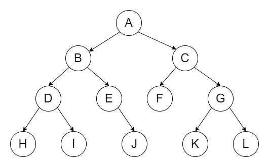 

### 二叉查找树

二叉查找树是在二叉树的基础上，左子节点的值小于当前节点，右子节点的值大于当前节点。基于以上的原则可以构成一个通过判断当前节点值的大小，然后查询对应节点的值从而使查找时间大幅下降的树。

下面是二叉查找树的一个简单示例：

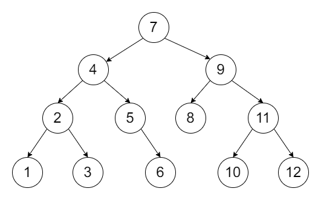 


## 平衡二叉树

由于二叉查找树在不断添加比已有节点值大或者小的值时，就会使二叉查找树退化为一个链表。为了避免这种情况发生，于是就出现了二叉查找树，通过在添加和删除时进行左旋或者右旋来保持二叉查找树的平衡。平衡二叉树最重要的特点就是每个节点到其子节点的最大值和最小值不可相差超过 1 。

从 1 开始逐个添加大于 1 的值，最终二叉查找树退化为链表

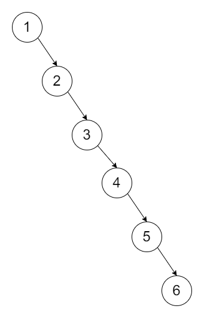 

接下来分析一下平衡二叉树的判断过程，首先树中添加 1 和 2 两个节点。

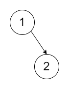 

再添加一个节点 3 。

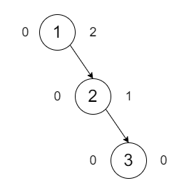 

可以看到上面在添加 3 节点后，根节点 1 的左右节点高度分别是 0 和 2，差值大于 1 所以现在的树需要进行调整。调整的方式就是将当前不平衡的节点向高度小的方向旋转，上面的树需要向左旋转。

下面是左旋转的步骤：

1. 将当前节点的位置由右子节点替代
2. 当前旋转的节点成为右子节点的左子节点
3. 如果有右子节点存在左子节点需要将其左子节点成为旋转节点的右子节点

> 右旋转的步骤与左旋转的步骤相反。

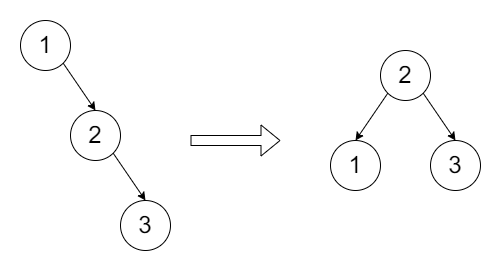 

上面是右侧高度过高的树进行左旋后的结构，如果当前旋转节点 1 右子节点 2 存在左子节点，旋转结构如下图所示：

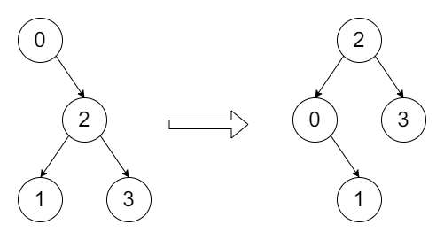 

下面是左右旋转的代码实现。

```java
/**
 * 左旋转
 * @param n
 *
 *       np                 np
 *       |                  |
 *       n                  nr
 *      / \       ==>      / \
 *    nl   nr             n   rr
 *        / \            / \
 *      rl   rr         nl  rl
 */
private void leftRotate(Node n){
    if (n == null)
        return;
    Node np = n.parent;
    Node nr = n.right;
    if (nr == null)
        return;
    Node rl = nr.left;
    if (np != null)
        if (np.left == n)
            np.left = nr;
        else
            np.right = nr;
    nr.left = n;
    nr.parent = np;
    n.right = rl;
    n.parent = nr;
    if (rl != null)
        rl.parent = n;
}
```

右旋转：

```java
/**
 * 右旋转
 * @param n
 *
 *       np                 np
 *       |                  |
 *       n                  nl
 *      / \       ==>      / \
 *    nl   nr            ll   n
 *   / \                     / \
 * ll   lr                  lr  nr
 */
private void rightRotate(Node n){
    if (n == null)
        return;
    Node np = n.parent;
    Node nl = n.left;
    if (nl == null)
        return;
    Node lr = nl.right;
    if (np != null)
        if (np.left == n)
            np.left = nl;
        else
            np.right = nl;
    nl.right = n;
    nl.parent = np;
    n.left = lr;
    n.parent = nl;
    if (lr != null)
        lr.parent = n;
}
```

> 由于平衡二叉树在添加节点和删除节点时都需要对当前的所有节点的左右子树进行高度判断，所以完全平衡二叉树的插入和删除的效率是十分低下的，所以就出现了 2-3-4树。

# 2-3-4树

2-3-4树有着和二叉树很多不同的特点，其操作也会相对复杂。首先我们可以发现上面的二叉树都是在外部节点，也就是树最下方去新增节点，也就是说二叉树是向下生长的。如果在向下生长的过程中会发生左右子节点高度不同的情况，如果将树设计成向上生长不就会自动实现平衡功能，当子节点添加之后不断向父节点推送子节点从而实现树的平衡。

2-3-4树的最大的特点之一就是其是向上生长的，其可以在生长的过程中自然而然的实现子树的高度平衡。又因为其的节点最多可以储存 3 个值且可以有 4 个子节点，从而使得其逻辑较为复杂。

2-3-4树中有三种状态的节点，下面是示例图：

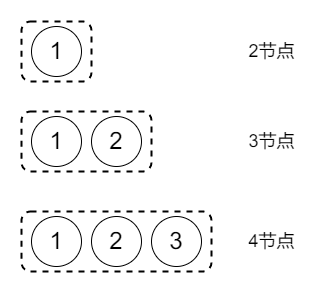 

其中的 2-3-4 即为节点可以存在几个子节点，当节点中只有一个值时只存在左右子节点，规则与二叉树的相同左侧小值右侧大值。当节点中存在两个值时，还可以有中间子节点，其值就是节点中两个值之间的值。4 节点也是同理，下面是节点及其子节点的示例：

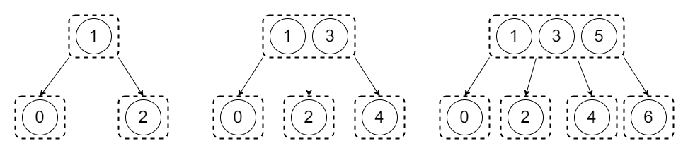 

那么 2-3-4 树是如何实现向上生长的，又是如何自动实现平衡的。

依旧是从 1 开始逐个新增元素，首先是前三个步骤。

 

可以看到，其由 2 节点新增之后会变成 3 和 4 节点，接着再新增一个节点，步骤如下：

1. 将已有的4节点拆分为 3 个独立的 2 节点，中间值上移一层成为上级节点。
2. 将新增的新值添加到拆分开的对应的子节点中

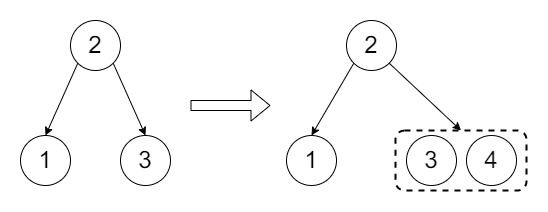 

如果新增的值是 2.5 只需要将其与 3 结合，2.5 在 3 的左侧即可，如果再次新增只需将新增的值添加到对应的节点中，构成一个新的 4 节点即可。

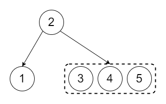 

当再次新增 6 时，与上面 4 节点拆分相同，需要将 4 上移与 2 进行合并构成一个 3 节点，然后将 6 与 5 进行合并构成一个 3 节点即可，效果如下图所示。

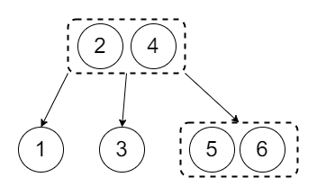 

借下来的流程就和上面介绍的相同，新的值会不断的把已有的值向上顶，从而不断增加树的高度，但是子节点的高度永远是平衡的。

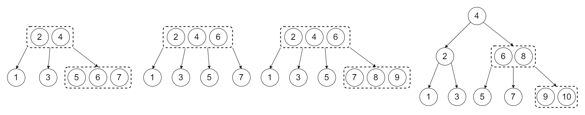 

 


# 红黑树

红黑树合并了平衡二叉树和 2-3-4树的部分特点，通过红色和黑色来表示 2-3-4树中的不同节点，从而实现向上生长并实现子树平衡。

下面是 2-3-4树与红黑树的等价关系。

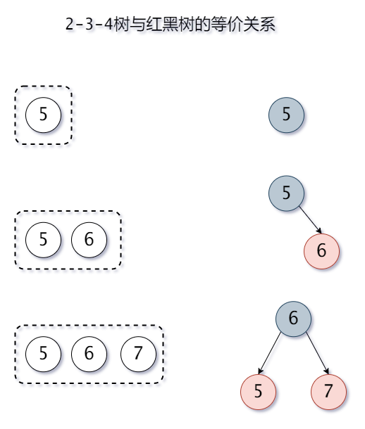 

可以看到红黑树其实是一个二叉树并通过颜色的方式来分别表示 2-3-4树中的三种状态的节点，红黑树只使用了 2-3-4树储存数据的概念，而真正实现平衡的方式还是通过节点的旋转来实现。

下面是一些红黑树的特点。

1. 根节点一定是黑色
2. 不可以有两个连续的红色节点
3. 根节点到任何叶子节点的黑色节点数量相同
4. 新添加的节点永远是红色

通过上面的等价关系可以得出，黑色的父节点和红色的子节点构成的部分在 2-3-4树中就是一个节点，通过 2-3-4 树添加节点的方式，我们可以推导出红黑树添加节点的方式。

首先是添加单个节点，红色节点添加进树之后由于其是根节点，所以就会变为黑色。

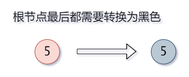 

添加第二个节点时发现父节点的颜色是黑色直接添加即可。

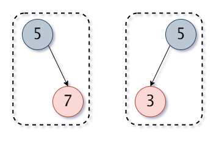 

此时节点就组成了相当于 2-3-4 树中的 3 节点，此时再添加一个节点就组成了 4 节点，但是如果当前添加的节点的值在上方的红色节点下，而我们需要将其改变为上层一个黑色节点下层两个红色节点的状态，才可以和 2-3-4 树的 4 节点吻合，所以我们需要旋转节点使其满足条件。

如果添加的节点正好构成了一个 4 节点，则不需要调整红黑树。

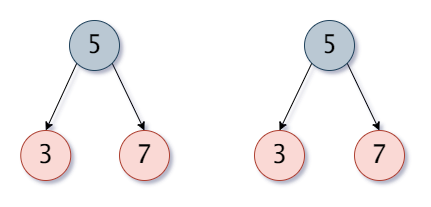 

如果添加的节点正好是当前节点右节点的右节点，需要先将新添加的节点的父节点变为黑色，祖父节点变为红色，最后与祖父节点为基础进行左旋。

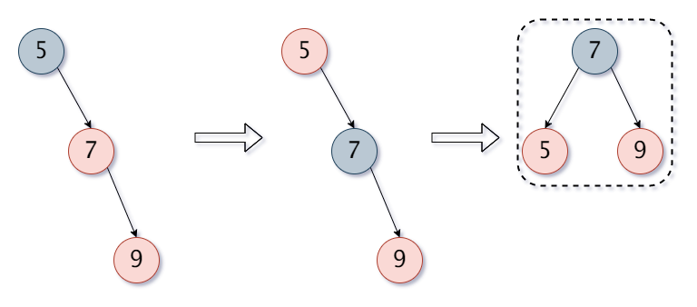 

如果添加节点是右子节点的左子节点，需要先以新添加节点的父节点为基础进行右旋，然后就变成了与上方红黑树一样的结构，随后进行依次操作即可。

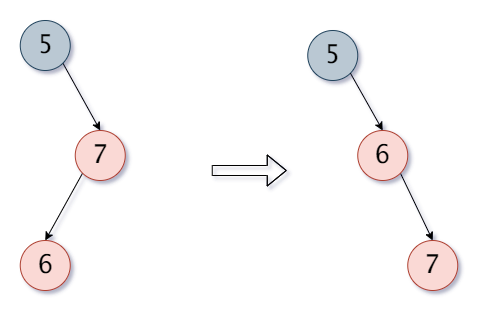 

如果子节点在当前节点的左侧，旋转的方向正好相反。

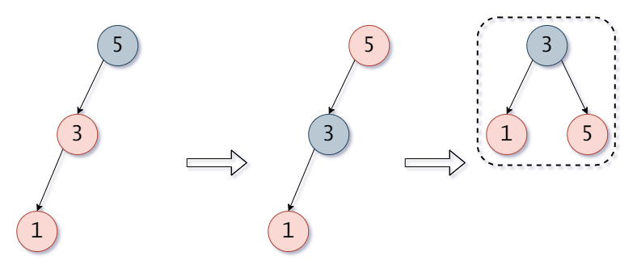 

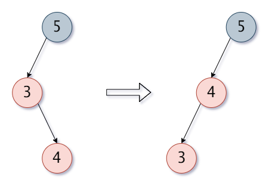 

接下来添加第四个元素

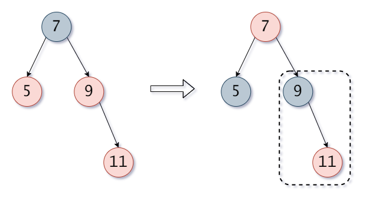 

我们可以通过判断当前新增节点的叔叔节点的颜色来判断当前的树是处于 3 节点状态还是 4 节点状态，此时通过变色来拆分当前已经存在的 4 节点，然后新增的节点就和变成黑色的父节点组成了一个 3 节点，最后将根节点修改为黑色。

当新增节点的祖父节点不是根节点时，有可能祖父节点的父节点也是红色，此时就需要调整上层的节点，于是就需要递归直至根节点为止。

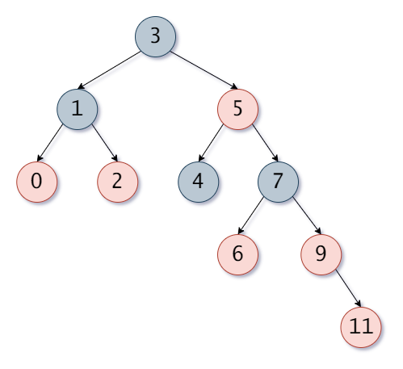 

在添加 11 之前，当前是一个正常的红黑树，但是在添加 11 之后需要将 6 和 9 变为黑色， 7 需要变为红色。但是 7 在变为红色之后，就与上方的 5 冲突，此时就需要再次将 7 认为一个新加入的节点进行一次调整。此时 7 的叔叔节点是黑色，此时的状态就等同于上方添加第三个节点时的状态，需要依据 3 进行左旋。所以在拆分 4 节点时需要对祖父节点进行递归调整，直至调整到根节点为止。


如果当前叔叔节点是黑色或者为空而当前的父节点为红色时，则表示当前祖父节点与父节点组成了一个 3 节点，此时的情况就相当于上方添加第三个节点时的情况，只需要对当前的祖父节点进行旋转。

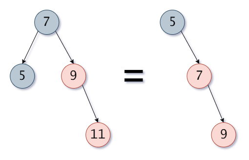 

