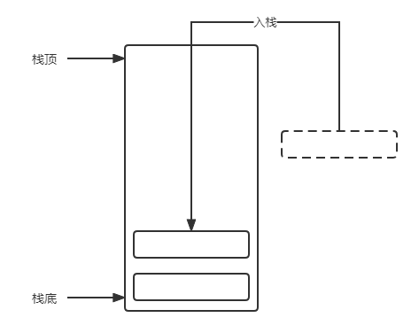
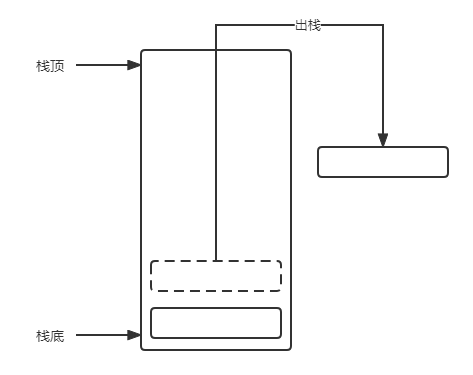
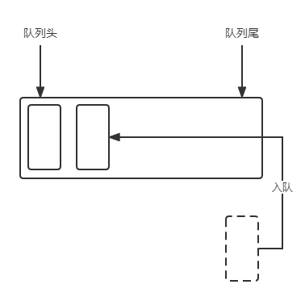
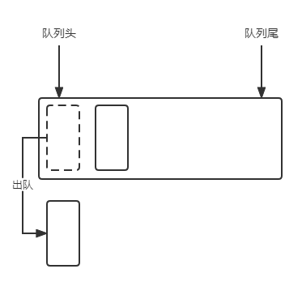
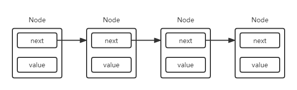
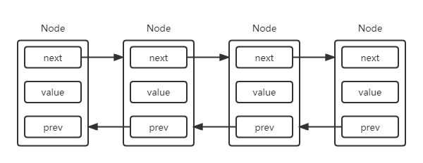
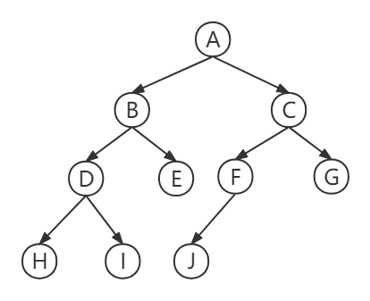
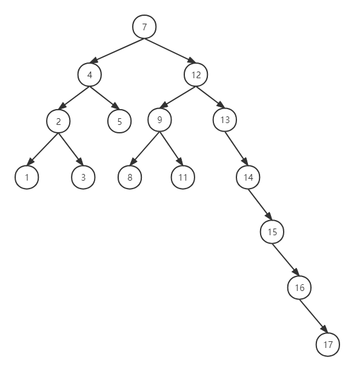

# 数组

## 概述

### 介绍

数组 `array` 是一种简单的复合数据类型，它是一组有序数据的一个集合，数组中的每个元素都具有相同的数据类型，可以使用下标来定位数组中的元素，在 java 中可以创建一维至多维数组。

java 中定义数组后 jvm 会在内存中寻找一块可以存放下数组的连续空间将数组存入。

### 特点

- 基础数据类型的默认值为0布尔值为 false ，引用类型则为 null 。
- 数组的索引（下标）从 0 开始到 length-1 结束。
- 数组的元素可以是基础数据类型、引用类型包括数组本身，这也是 java 可以创建多维数组的原因。
- 数组类型是从抽象类型 Array 派生的引用类型，即数组也是一个对象。
- 数组是固定长度的，其会在定义数组时固定其长度，即数组是不可变的。

## 使用

### 定义

在定义数组时可以指定数组的大小，其中元素的内容将会是储存类型的默认值。

```java
int[] arr1 = new int[10];
```

也可以在定义数组时直接设置数组中的元素。

```java
int[] arr2 = {1,2,3};
int[] arr3 = new int[]{1,2,3};
```

### 存取元素

可以直接使用下标对指定元素进行取值或者赋值操作。

```java
arr2[0] // 1 取值
arr2[0] = 9 // 赋值
```

### 遍历

使用 for 循环对数组进行遍历，数组的 length 属性存储着数组的大小，通过 for 循环自增即可遍历数组。

```java
for (int i = 0; i < arr2.length; i++) {
    System.out.println(arr2[i]);
}
```

使用 for 循环的简写形式进行遍历

```java
for (int a : arr2) {
    System.out.println(a);
}
```

# 栈

栈遵循先进后出 `LIFO` 原则，新添加的元素会存入栈顶，而再次新增元素时旧元素就会被新元素覆盖，最先加入栈的元素就会在栈底。当出栈时总是最新加入的元素先出栈，而在其之下的元素才会出现从而出栈。

使用栈的结构可以解决类似反转集合的操作，只需要将元素全部入栈再出栈即可。

在 java 中可以利用数组来实现栈的功能，当然也可以使用引用类型来实现。java 中 Stack 类实现了栈的功能，其继承来 Vector 类，其使用对象数组 `Object[]` 来实现栈的功能。具体分析在 Java 容器中。

 

 


# 队列

队列与栈相反，其遵循先进先出 `FIFO` 原则，在队列尾新增元素，在队列头移除元素。

双端队列 `deque` `double-ended queue` 是一种特殊的队列，其允许同时从前后添加或者移除元素。

 

 


# 链表

链表也是储存有序元素的一个集合，其与数组的不同之处在于链表中的每个元素都指向下一个元素，从而构成类似链条的数据结构。如果一个元素中同时拥有指向前后元素的引用，即会变成一个双向链表。

java 中链表有着不同的实现，可以使用对象构成节点实现链表，也可以使用数组来实现链表。

 

 


# 树

## 概述

树是一种非顺序数据结构，其中的元素被成为节点，每一个节点可以有多个子节点，且都有一个父节点，其中根节点除外。在树中，最顶部的节点被称为根节点，而树底部没有子节点的节点被称为外部节点，而根节点和子节点之间的节点被称为内部节点。由根节点的子节点及其子节点构成的树称作子树，

 

其中 `A` 为根节点 `H` `I` `E` `J` `G` 为外部节点， `B` `C` `D` `E` `F` 为内部节点，由 `B` `D` `E` `H` `I` 组成的树被称为子树。

## 二叉树

二叉树意为其子节点最多只能有两个，即左侧子节点与右侧子节点。二叉树有助于更加高效的在树中进行增删改查。

二叉搜索树 `BST` 时二叉树的一种，其只允许左侧节点的值小于父节点，右侧节点的值大于父节点，这种格式更加有利于查询值。

### 自平衡树

在使用二叉搜索树时，如果当前根节点是需要添加的所有元素中较小或者较大的值时，在将元素不断加入二叉树后就会使二叉树其中一边变得过于长，如下图所示。这时就需要使用二叉平衡树来解决这个问题。

 

自平衡二叉搜索树 `Adelson-Velskii-Land` `AVL` 的两侧子树的高度之差最多为 1 ，在添加或者删除节点时，`AVL` 树会尝试保持平衡。


# 二叉树


# 图

